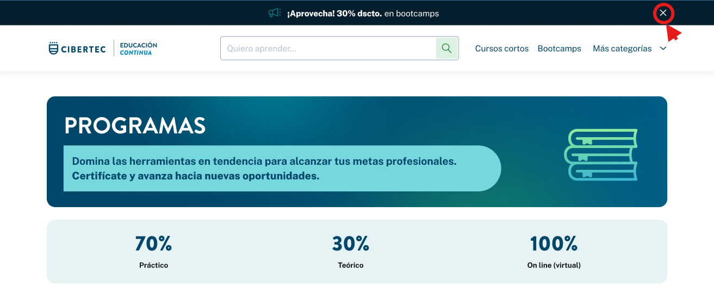

# Guía Visual: menu_cintillo_cerrar
**Payload General:** [../00-home/00-menu/menu_cintillo_cerrar.yaml](../00-home/00-menu/menu_cintillo_cerrar.yaml)

---
## Instancia: menu_cintillo_cerrar
- **Descripción:** Este evento se activa cuando el usuario hace clic en el icono de cerrar del cintillo.



**Data Layer (Payload):**
```yaml
{
  "event"       : "ui_interaction",        # Nombre fijo del evento
  "ui_location" : "sticky_bar",            # Dónde está el elemento
  "ui_element"  : "icon",                  # Qué es el elemento
  "ui_action"   : "click",                 # Qué hace (open_modal, navigation, etc.)
  "ui_label"    : "cerrar",                # Identificador único o texto del elemento
  "ui_hierarchy": "{{home > cintillo}}",   # Identificador semantico de la seccion donde se ubica.
  "link_url"    : "{{url_destino}}"        # Si te dirige hacia algun otro lugar, abre algun modal o cambia de vista o pagina web.
}
```
