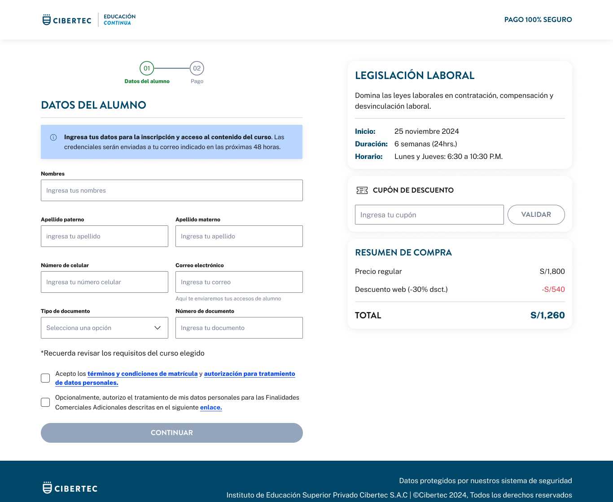

# Guía Visual: begin_checkout
**Payload General:** [../01-checkout/begin_checkout.yaml](../01-checkout/begin_checkout.yaml)

---
## Instancia: begin_checkout
- **Descripción:** Cuando el usuario llega al apartado del checkout (step 1).



**Data Layer (Payload):**
```yaml
{
  # --- 1. Identificación del Evento (GA4 Standard) ---
  "event": "begin_checkout",

  # --- 2. Parámetros de Comercio (OBLIGATORIO en GA4) ---
  "ecommerce": {
    "currency": "{{ISO_4217}}",         # Ej: "PEN", "USD"
    "value"   : "{{valor_producto}}",   # Valor total de los productos en el carrito
    "coupon"  : "{{string}}",           # (Opcional) Cupón aplicado al iniciar
    "items"   : [                       # Array de productos en el carrito
      {
        "item_id"       : "{{sku}}",
        "item_name"     : "{{product_name}}",
        "price"         : "{{valor_producto}}",
        "quantity"      : "{{cantidad}}",
        "discount"      : "{{discount_value}}",
        "item_category" : "{{category_l1}}",      # Mapeado de tu category_l1, null si no aplica.
        "item_category2": "{{category_l2}}",      # Mapeado de tu category_l2, null si no aplica.
        "item_category3": "{{category_l3}}",      # Mapeado de tu category_l3, null si no aplica.
        "item_category4": "{{category_l4}}"       # Mapeado de tu category_l4, null si no aplica.
      },
      # Se repite la estructura por cada item dentro del carrito.
    ]
  }
}
```
