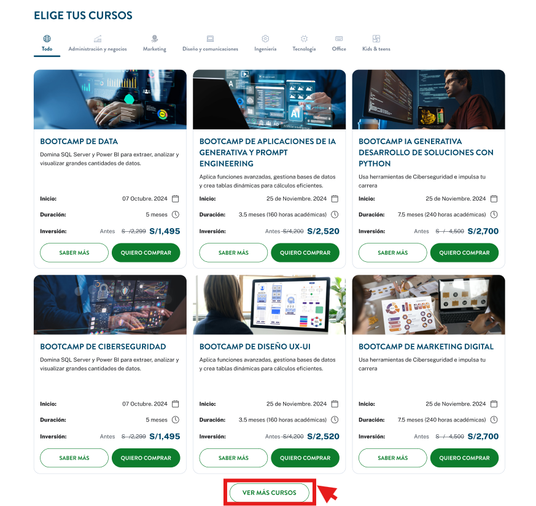

# Guía Visual: button_mas_cursos
**Payload General:** [../03-programas/button_mas_cursos.yaml](../03-programas/button_mas_cursos.yaml)

---
## Instancia: button_mas_cursos
- **Descripción:** Cuando el usuario da click an el boton que muestra todos los programas o cursos.



**Data Layer (Payload):**
```yaml
{
  "event"       : "ui_interaction",   # Nombre fijo del evento
  "ui_location" : "content_body",     # Dónde está el elemento
  "ui_element"  : "button",           # Qué es el elemento
  "ui_action"   : "click",            # Qué hace (open_modal, navigation, etc.)
  "ui_label"    : "ver_mas_cursos",   # Identificador único o texto del elemento
  "ui_hierarchy": "programas",        # Identificador semantico de la seccion donde se ubica.
  "link_url"    : "{{url_destino}}"   # Si te dirige hacia algun otro lugar, abre algun modal o cambia de vista o pagina web.
}
```
