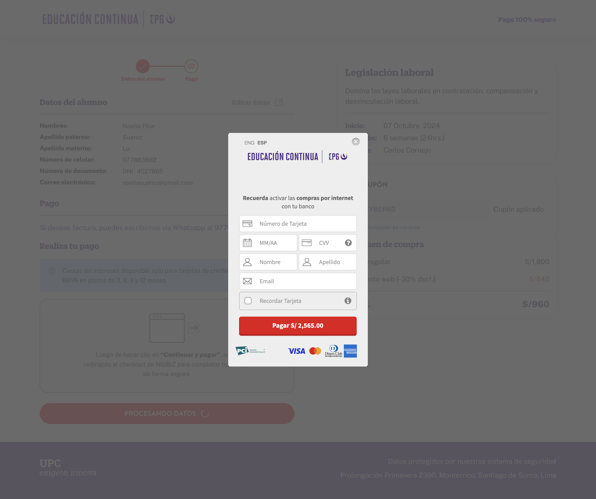

# Guía Visual: add_payment_info
**Payload General:** [../01-checkout/add_payment_info.yaml](../01-checkout/add_payment_info.yaml)

---
## Instancia: add_payment_info
- **Descripción:** Cuando se da click al boton "Pagar" de la pasarela de pago. Step 4



**Data Layer (Payload):**
```yaml
{
  "event": "add_payment_info",
  "ecommerce": {
    "currency"    : "{{ISO_4217}}",      # Ej: "PEN", "USD"
    "value"       : "{{valor_total}}",   # Valor total (puede incluir envío si aplica)
    "coupon"      : "{{string}}",        # (Opcional) Cupón aplicado
    "payment_type": "{{string}}",        # ESPECÍFICO DE ESTE EVENTO. Ej: "Credit Card", "Yape", "PayPal"
    "items": [                        # Array de productos (debe persistir en cada paso)
      {
        "item_id"       : "{{sku}}",
        "item_name"     : "{{product_name}}",
        "price"         : "{{valor_producto}}",
        "discount"      : "{{discount_value}}",
        "quantity"      : "{{cantidad}}",
        "item_category" : "{{category_l1}}",      # Mapeado de tu category_l1, null si no aplica.
        "item_category2": "{{category_l2}}",      # Mapeado de tu category_l2, null si no aplica.
        "item_category3": "{{category_l3}}",      # Mapeado de tu category_l3, null si no aplica.
        "item_category4": "{{category_l4}}"       # Mapeado de tu category_l4, null si no aplica.
      },
      # Se repite la estructura por cada item dentro del carrito.
    ]
  }
}
```
