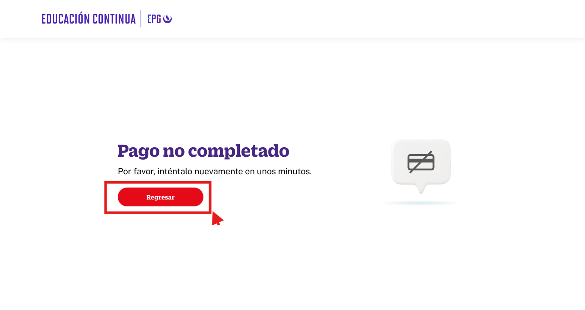

# Guía Visual: button_pago_no_completado
**Payload General:** [../01-checkout/button_pago_no_completado.yaml](../01-checkout/button_pago_no_completado.yaml)

---
## Instancia: button_pago_no_completado
- **Descripción:** Cuando el pago no es completado y el usuario de click en el boton "Regresar al home" (Step 5).



**Data Layer (Payload):**
```yaml
{
  "event"       : "ui_interaction",     # Nombre fijo del evento
  "ui_location" : "content_body",       # Dónde está el elemento
  "ui_element"  : "button",             # Qué es el elemento
  "ui_action"   : "click",              # Qué hace (open_modal, navigation, etc.)
  "ui_label"    : "regresar_al_home",   # Identificador único o texto del elemento
  "ui_hierarchy": "checkout",           # Identificador semantico de la seccion donde se ubica.
  "link_url"    : "{{url_destino}}"     # Si te dirige hacia algun otro lugar, abre algun modal o cambia de vista o pagina web.
}
```
