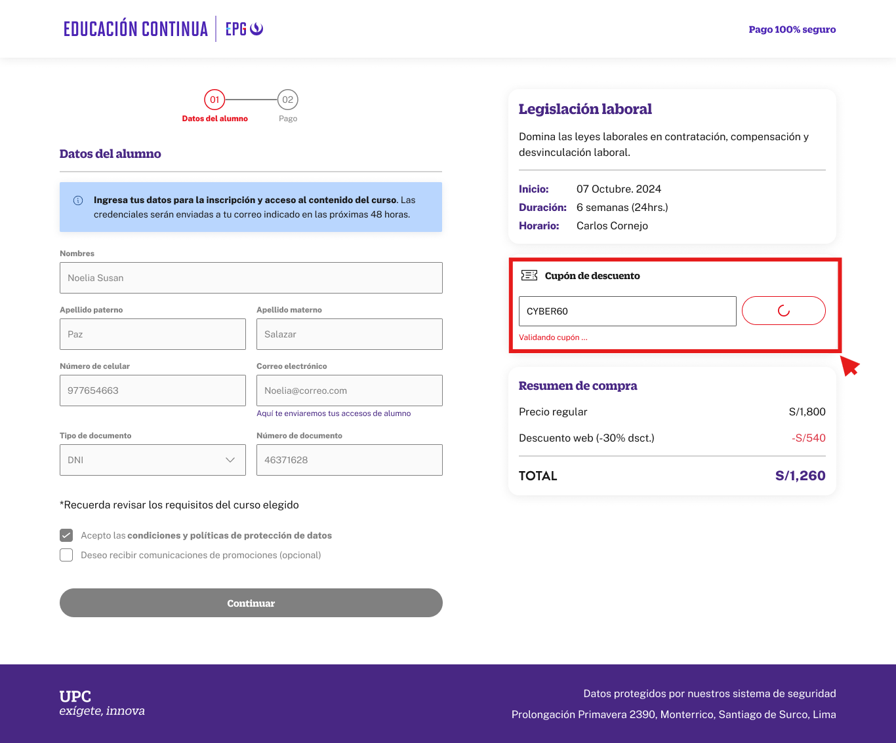

# Guía Visual: button_validar_coupon
**Payload General:** [../01-checkout/button_validar_coupon.yaml](../01-checkout/button_validar_coupon.yaml)

---
## Instancia: button_validar_coupon
- **Descripción:** Cuando el usuario en el proceso de checkout, ingresa un cupon en el apartado correspondiente y le da VALIDAR (step 3).



**Data Layer (Payload):**
```yaml
{
  "event"       : "ui_interaction",               # Nombre fijo del evento
  "ui_location" : "content_body",                 # Dónde está el elemento
  "ui_element"  : "button",                       # Qué es el elemento
  "ui_action"   : "click",                        # Qué hace (open_modal, navigation, etc.)
  "ui_label"    : "validar > {{coupon_value}}",   # Identificador único o texto del elemento
  "ui_hierarchy": "checkout",                     # Identificador semantico de la seccion donde se ubica.
  "link_url"    : "{{url_destino}}"               # Si te dirige hacia algun otro lugar, abre algun modal o cambia de vista o pagina web.
}
```
