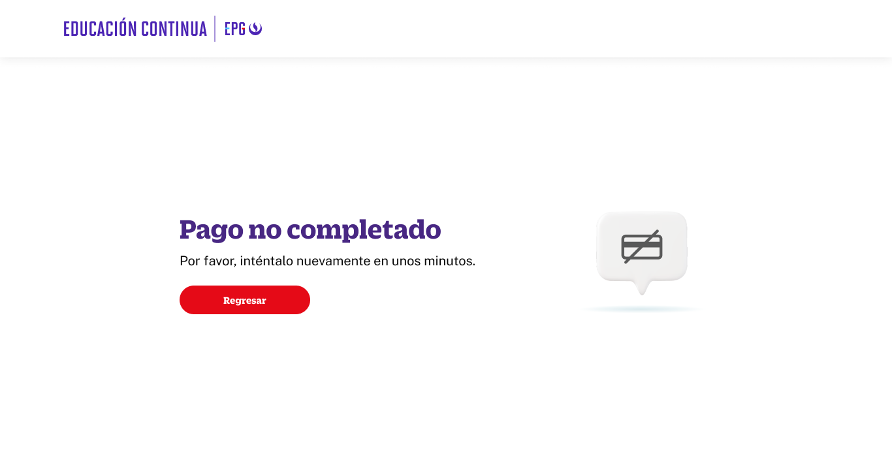

# Guía Visual: page_view_pago_no_completado
**Payload General:** [../01-checkout/page_view_pago_no_completado.yaml](../01-checkout/page_view_pago_no_completado.yaml)

---
## Instancia: page_view_pago_no_completado
- **Descripción:** Cuando el pago no es completado y el usuario da click en el boton "Regresar al home". Step 5



**Data Layer (Payload):**
```yaml
{
  "event"         : "page_view",            # Nombre unificado del evento
  "screen_name"   : "pago_no_completado",   # Nombre legible (Ej: "Home", "Zona cachimbos")
  "screen_type"   : "error",                # Tipo técnico de la pantalla
  "screen_section": "checkout",             # Agrupación temática macro (Content Group)
  "category_l1"   : null,
  "category_l2"   : null,
  "category_l3"   : null,
  "entity_id"     : null,
  "entity_name"   : null,
  "search_term"   : null,
  "result_count"  : null
}
```
