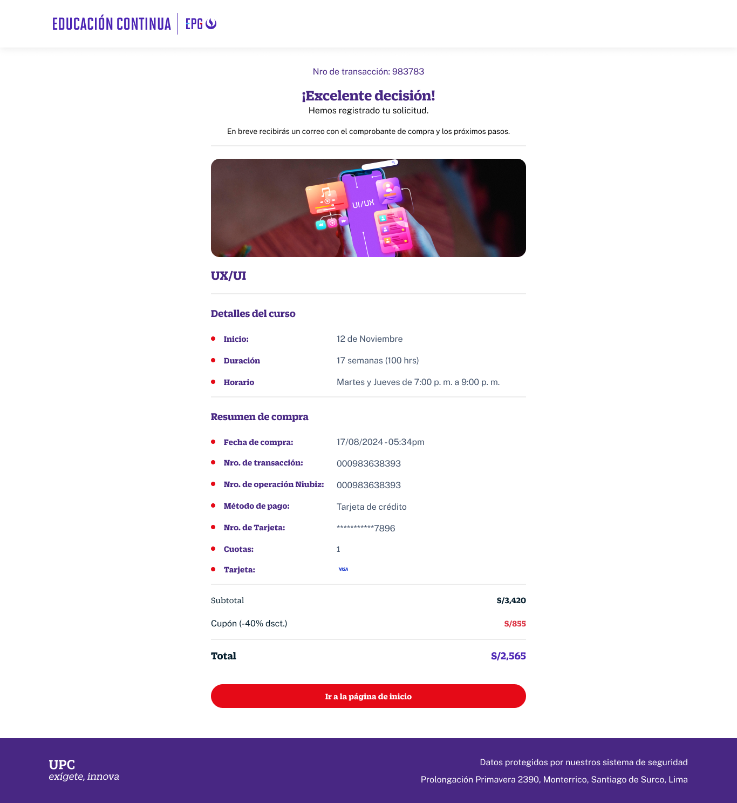

# Guía Visual: purchase
**Payload General:** [../01-checkout/purchase.yaml](../01-checkout/purchase.yaml)

---
## Instancia: purchase
- **Descripción:** Cuando se muestre el "Than You Page" (Se finaliza la compra).



**Data Layer (Payload):**
```yaml
{
  "event": "purchase",
  "ecommerce": {
    "transaction_id": "{{order_id}}",       # OBLIGATORIO. ID único de la orden (Backend).
    "currency"      : "{{ISO_4217}}",       # Ej: "PEN", "USD"
    "value"         : "{{valor_total}}",    # Valor final cobrado (Producto + Envío + Impuestos - Descuentos)
    "tax"           : "{{impuesto}}",       # Monto de impuestos (Ej: IGV/IVA).
    "shipping"      : "{{envio}}",          # Costo de envío cobrado.
    "coupon"        : "{{order_coupon}}",   # Cupón aplicado a nivel de toda la orden (opcional).
    "items": [                              # Array final de productos comprados.
      {
        "item_id"       : "{{sku}}",
        "item_name"     : "{{product_name}}",
        "price"         : "{{valor_producto}}",
        "discount"      : "{{discount_value}}",   # Descuento por ítem unitario.
        "quantity"      : "{{cantidad}}",
        "item_category" : "{{category_l1}}",
        "item_category2": "{{category_l2}}",
        "item_category3": "{{category_l3}}",
        "item_category4": "{{category_l4}}"
      }
      # Se repite por cada item comprado.
    ]
  }
}
```
