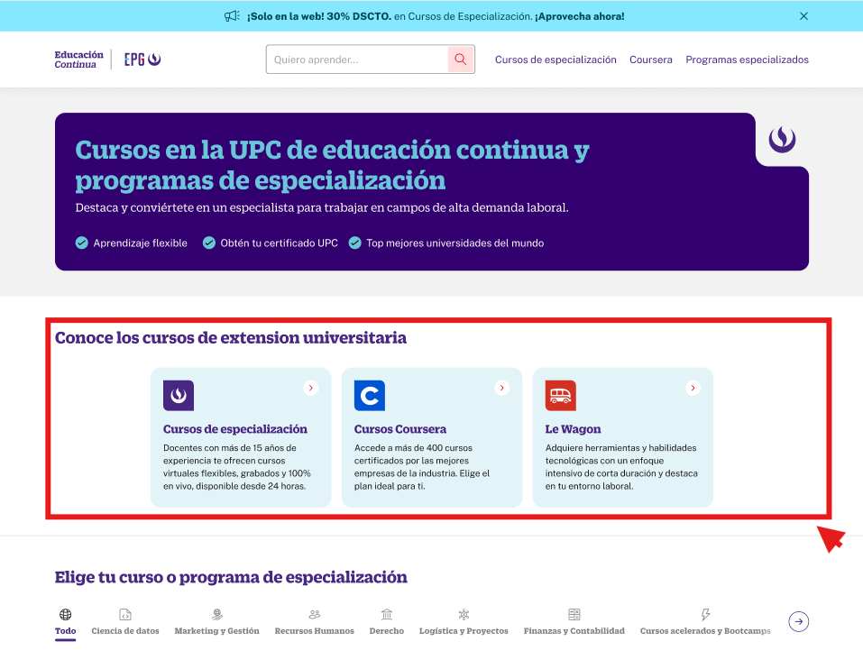

# Guía Visual: list_item_grupo_curso
**Payload General:** [../04-programas-especializacion/list_item_grupo_curso.yaml](../04-programas-especializacion/list_item_grupo_curso.yaml)

---
## Instancia: list_item_grupo_curso
- **Descripción:** Cuando el usuario selecciona un apartado (grupo de cursos) dentro de la navegación.



**Data Layer (Payload):**
```yaml
{
  "event"       : "ui_interaction",                                   # Nombre fijo del evento
  "ui_location" : "carousel",                                         # Dónde está el elemento
  "ui_element"  : "list_item",                                        # Qué es el elemento
  "ui_action"   : "click",                                            # Qué hace (open_modal, navigation, etc.)
  "ui_label"    : "{{grupo_curso_label}}",                            # Esto debe enviar el texto principal del elemento
  "ui_hierarchy": "cursos_especializacion > especializate_y_crece",   # Identificador semantico de la seccion donde se ubica.
  "link_url"    : "{{url_destino}}"                                    # Si te dirige hacia algun otro lugar, abre algun modal o cambia de vista o pagina web.
}
```
