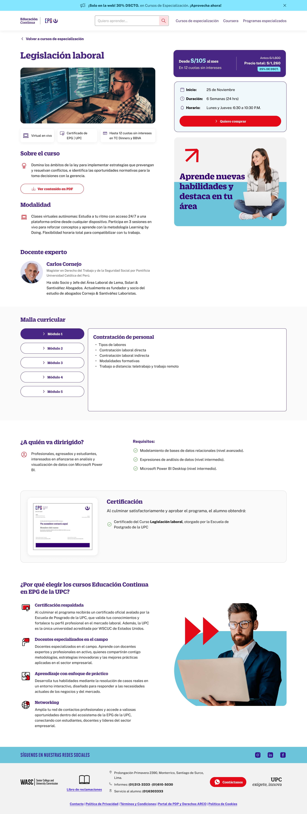

# Guía Visual: page_view_curso
**Payload General:** [../page_view_curso.yaml](../page_view_curso.yaml)

---
## Instancia: page_view_curso
- **Descripción:** Cuando se llega a la pagina dedicada del producto (curso).



**Data Layer (Payload):**
```yaml
{
  "event"         : "screen_view",                         # Nombre unificado del evento
  "screen_name"   : "pagina_curso > {{producto_label}}",   # Nombre legible (Ej: "Home", "Zona cachimbos")
  "screen_type"   : "dashboard",                           # Tipo técnico de la pantalla
  "screen_section": "inicio",                              # Agrupación temática macro (Content Group)
  "category_l1"   : null,
  "category_l2"   : null,
  "category_l3"   : null,
  "entity_id"     : null,                                  # (Opcional) ID del producto/post/item
  "entity_name"   : null,                                  # (Opcional) Nombre de la entidad principal
  "search_term"   : null,                                  # (Opcional) Lo que escribió el usuario
  "result_count"  : null                                   # (Opcional) Cantidad de resultados encontrados
}
```
