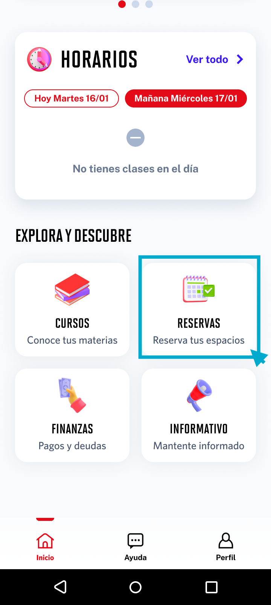

# Guía Visual: card_reservas
**Payload General:** [../00-home/00-explora-y-descubre/card_reservas.yaml](../00-home/00-explora-y-descubre/card_reservas.yaml)

---
## Instancia: card_reservas
- **Descripción:** Click en el card Reservas en la sección Explora y descubre.



**Data Layer (Payload):**
```yaml
{
  "event"       : "ui_interaction",                # Nombre fijo del evento
  "ui_location" : "content_body",                  # Dónde está el elemento
  "ui_element"  : "card",                          # Qué es el elemento
  "ui_action"   : "click",                         # Qué hace (open_modal, navigation, etc.)
  "ui_label"    : "card_reservas",                 # Esto debe enviar el texto principal del card
  "ui_hierarchy": "inicio > explora_y_descubre",   # Identificador semantico de la seccion donde se ubica.
  "link_url"    : "{{url_desino}}"                 # Si te dirige hacia algun otro lugar, abre algun modal o cambia de vista o pagina web.
}
```
