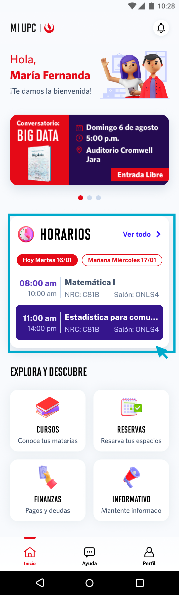

# Guía Visual: widget_horarios
**Payload General:** [../00-home/03-dashboard/widget_horarios.yaml](../00-home/03-dashboard/widget_horarios.yaml)

---
## Instancia: widget_horarios
- **Descripción:** Click en el widget Horarios en la sección Dashboard.



**Data Layer (Payload):**
```yaml
{
  "event"       : "ui_interaction",                # Nombre fijo del evento
  "ui_location" : "content_body",                  # Dónde está el elemento
  "ui_element": "card",                          # Qué es el elemento
  "ui_action"   : "click",                         # Qué hace (open_modal, navigation, etc.)
  "ui_label"    : "widget_horarios",                 # Esto debe enviar el texto principal del card
  "ui_hierarchy": "inicio > dashboard",   # Identificador semantico de la seccion donde se ubica.
  "link_url"    : "{{url_destino}}"                 # Si te dirige hacia algun otro lugar, abre algun modal o cambia de vista o pagina web.
}
```
