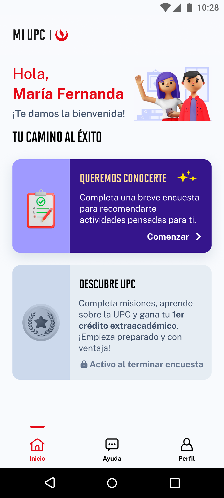

# Guía Visual: card_cachimbo
**Payload General:** [../00-home/card_cachimbo.yaml](../00-home/card_cachimbo.yaml)

---
## Instancia: card_cachimbo
- **Descripción:** Captura la interaccion de **click** del usuario con el card relacionado a **Cachimbo UPC**.



**Data Layer (Payload):**
```yaml
{
  "event"       : "ui_interaction",   # Nombre fijo del evento
  "ui_location" : "content_body",     # Dónde está el elemento
  "ui_element"  : "card",             # Qué es el elemento
  "ui_action"   : "click",            # Qué hace (open_modal, navigation, etc.)
  "ui_label"    : "cachimbo_upc",     # Esto debe enviar el texto principal del elemento
  "ui_hierarchy": "inicio",           # Identificador semantico de la seccion donde se ubica.
  "link_url"    : "{{url_destino}}"    # Si te dirige hacia algun otro lugar, abre algun modal o cambia de vista o pagina web.
}
```
