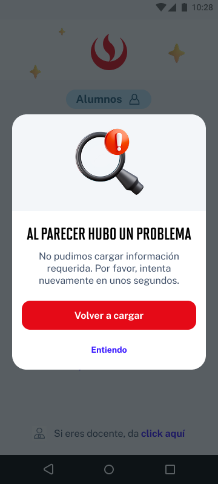

# Guía Visual: modal_pwd_error
**Payload General:** [../01-login/modal_pwd_error.yaml](../01-login/modal_pwd_error.yaml)

---
## Instancia: modal_pwd_error
- **Descripción:** Cuando se le muestra el modal de error al momento de ingresar la contraseña. Nos sirve para tracking de actividad del usuario con el app.



**Data Layer (Payload):**
```yaml
{
  "event"       : "ui_interaction",    # Nombre fijo del evento
  "ui_location" : "modal_window",      # Dónde está el elemento
  "ui_element"  : "modal_window",      # Qué es el elemento
  "ui_action"   : "open_modal",        # Qué hace (open_modal, navigation, etc.)
  "ui_label"    : "{{modal_label}}",   # Esto debe enviar el texto principal del elemento
  "ui_hierarchy": "login",             # Identificador semantico de la seccion donde se ubica.
  "link_url"    : "{{url_destino}}"     # Si te dirige hacia algun otro lugar, abre algun modal o cambia de vista o pagina web.
}
```
