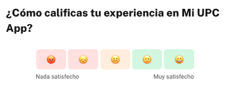

# Guía Visual: button_csat_enviar
**Payload General:** [../02-ayuda/button_csat_enviar.yaml](../02-ayuda/button_csat_enviar.yaml)

---
## Instancia: button_csat_enviar
- **Descripción:** Evento capturado al hacer click en "enviar" en la valoración CSAT.



**Data Layer (Payload):**
```yaml
{
  "event"       : "ui_interaction",          # Nombre fijo del evento
  "ui_location" : "modal_window",            # Dónde está el elemento
  "ui_element"  : "button",                  # Qué es el elemento
  "ui_action"   : "click",                   # Qué hace (open_modal, navigation, etc.)
  "ui_label"    : "enviar_respuesta_csat",   # Identificador único o texto del elemento
  "ui_hierarchy": "ayuda",                   # Identificador semantico de la seccion donde se ubica.
  "link_url"    : "{{url_destino}}"          # Si te dirige hacia algun otro lugar, abre algun modal o cambia de vista o pagina web.
}
```
