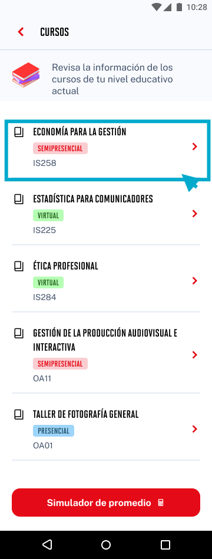

# Guía Visual: list_item_curso
**Payload General:** [../04-cursos/list_item_curso.yaml](../04-cursos/list_item_curso.yaml)

---
## Instancia: list_item_curso
- **Descripción:** Click en cualquier elemento de la lista de cursos. Se capturan datos dinámicos como el nombre del curso.



**Data Layer (Payload):**
```yaml
{
  "event"       : "ui_interaction",     # Nombre fijo del evento
  "ui_location" : "list_view",          # Dónde está el elemento
  "ui_element"  : "list_item",          # Qué es el elemento
  "ui_action"   : "click",              # Qué hace (open_modal, navigation, etc.)
  "ui_label"    : "{{nombre_curso}}",   # Esto debe enviar el texto principal del elemento
  "ui_hierarchy": "cursos",             # Identificador semantico de la seccion donde se ubica.
  "link_url"    : "{{url_desino}}"      # Si te dirige hacia algun otro lugar, abre algun modal o cambia de vista o pagina web.
}
```
