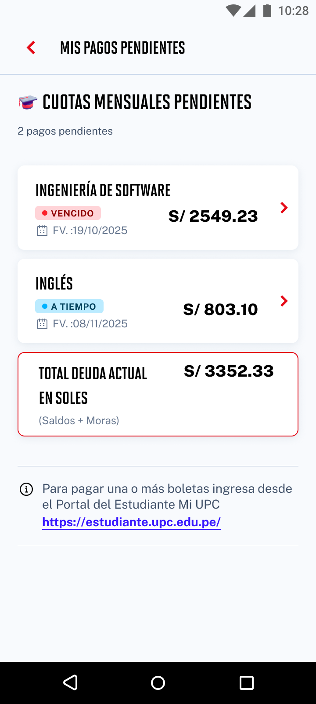

# Guía Visual: card_detalle_pago
**Payload General:** [../05-finanzas/00-mis-pagos-pendientes/card_detalle_pago.yaml](../05-finanzas/00-mis-pagos-pendientes/card_detalle_pago.yaml)

---
## Instancia: card_detalle_pago
- **Descripción:** Click en cualquier card relacionado a pagos pendientes. Vital para modelos analíticos.



**Data Layer (Payload):**
```yaml
{
  "event"       : "ui_interaction",                    # Nombre fijo del evento
  "ui_location" : "content_body",                      # Dónde está el elemento
  "ui_element"  : "card",                              # Qué es el elemento
  "ui_action"   : "click",                             # Qué hace (open_modal, navigation, etc.)
  "ui_label"    : "detalle_pago",                      # Esto debe enviar el texto principal del card
  "ui_hierarchy": "finanzas > mis_pagos_pendientes",   # Identificador semantico de la seccion donde se ubica.
  "link_url"    : "{{url_desino}}"                     # Si te dirige hacia algun otro lugar, abre algun modal o cambia de vista o pagina web.

}
```
