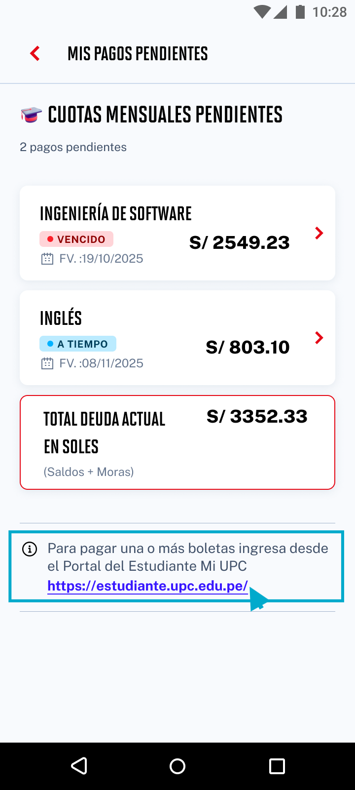

# Guía Visual: link_portal_upc
**Payload General:** [../05-finanzas/00-mis-pagos-pendientes/link_portal_upc.yaml](../05-finanzas/00-mis-pagos-pendientes/link_portal_upc.yaml)

---
## Instancia: link_portal_upc
- **Descripción:** Click al enlace que dirige al portal del estudiante.



**Data Layer (Payload):**
```yaml
{
  "event"       : "ui_interaction",                    # Nombre fijo del evento
  "ui_location" : "content_body",                      # Dónde está el elemento
  "ui_element": "text_link",                              # Qué es el elemento
  "ui_action"   : "click",                             # Qué hace (open_modal, navigation, etc.)
  "ui_label"    : "link_portal_upc",                   # Esto debe enviar el texto principal del card
  "ui_hierarchy": "finanzas > mis_pagos_pendientes",   # Identificador semantico de la seccion donde se ubica.
  "link_url"    : "{{url_destino}}"                     # Si te dirige hacia algun otro lugar, abre algun modal o cambia de vista o pagina web.
}
```
