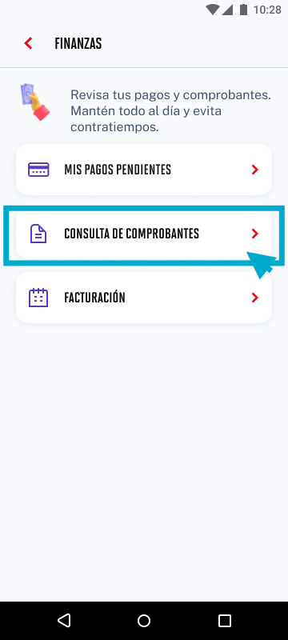

# Guía Visual: card_consulta_comprobantes
**Payload General:** [../05-finanzas/card_consulta_comprobantes.yaml](../05-finanzas/card_consulta_comprobantes.yaml)

---
## Instancia: card_consulta_comprobantes
- **Descripción:** Click en el card de Consulta de Comprobantes.



**Data Layer (Payload):**
```yaml
{
  "event"       : "ui_interaction",          # Nombre fijo del evento
  "ui_location" : "content_body",            # Dónde está el elemento
  "ui_element"  : "card",                    # Qué es el elemento
  "ui_action"   : "click",                   # Qué hace (open_modal, navigation, etc.)
  "ui_label"    : "consulta_comprobantes",   # Esto debe enviar el texto principal del card
  "ui_hierarchy": "finanzas",                # Identificador semantico de la seccion donde se ubica.
  "link_url"    : "{{url_destino}}"           # Si te dirige hacia algun otro lugar, abre algun modal o cambia de vista o pagina web.
}
```
