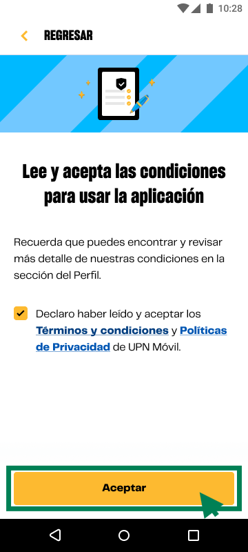

# Guía Visual: button_tyc
**Payload General:** [../00-login/button_tyc.yaml](../00-login/button_tyc.yaml)

---
## Instancia: button_tyc
- **Descripción:** Cuando el usuario hace click en el botón de **aceptar** de los términos y condiciones. Este proceso se levanta al momento del primer ingreso al app.



**Data Layer (Payload):**
```yaml
{
  "event"       : "ui_interaction",   # Nombre fijo del evento
  "ui_location" : "content_body",     # Dónde está el elemento
  "ui_element"  : "button",           # Qué es el elemento
  "ui_action"   : "click",            # Qué hace (open_modal, navigation, etc.)
  "ui_label"    : "aceptar_tyc",      # Identificador único o texto del elemento
  "ui_hierarchy": "login",            # Identificador semantico de la seccion donde se ubica.
  "link_url"    : "{{url_destino}}"   # Si te dirige hacia algun otro lugar, abre algun modal o cambia de vista o pagina web.
}
```
