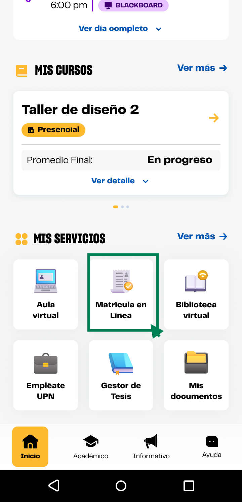

# Guía Visual: card_matricula_en_linea
**Payload General:** [../01-home/00-mis-servicios/card_matricula_en_linea.yaml](../01-home/00-mis-servicios/card_matricula_en_linea.yaml)

---
## Instancia: card_matricula_en_linea
- **Descripción:** Click en el card Matrícula en línea en la sección Mis servicios del inicio.



**Data Layer (Payload):**
```yaml
{
  "event"       : "ui_interaction",           # Nombre fijo del evento
  "ui_location" : "content_body",             # Dónde está el elemento
  "ui_element"  : "card",                     # Qué es el elemento
  "ui_action"   : "click",                    # Qué hace (open_modal, navigation, etc.)
  "ui_label"    : "matricula_en_linea",       # Esto debe enviar el texto principal del elemento
  "ui_hierarchy": "inicio > mis_servicios",   # Identificador semantico de la seccion donde se ubica.
  "link_url"    : "{{url_desino}}"            # Si te dirige hacia algun otro lugar, abre algun modal o cambia de vista o pagina web.
}
```
