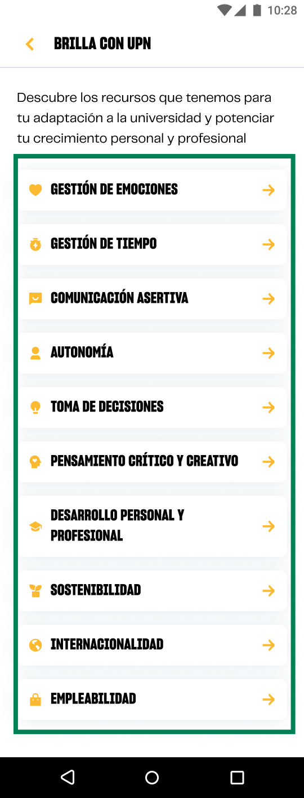

# Guía Visual: button_enlace
**Payload General:** [../01-home/01-brilla_con-upn/button_enlace.yaml](../01-home/01-brilla_con-upn/button_enlace.yaml)

---
## Instancia: button_enlace
- **Descripción:** Busca trackear el click de enlaces que se encuentran dentro de cada recurso mostrado dentro de la sección.



**Data Layer (Payload):**
```yaml
{
  "event"       : "ui_interaction",                                # Nombre fijo del evento
  "ui_location" : "content_body",                                  # Dónde está el elemento
  "ui_element"  : "button",                                        # Qué es el elemento
  "ui_action"   : "click",                                         # Qué hace (open_modal, navigation, etc.)
  "ui_label"    : "{{button_label}}",                              # Identificador único o texto del elemento
  "ui_hierarchy": "inicio > brilla_con_upn > {{recurso_label}}",   # Identificador semantico de la seccion donde se ubica.
  "link_url"    : "{{url_destino}}"                                # Si te dirige hacia algun otro lugar, abre algun modal o cambia de vista o pagina web.
}
```
