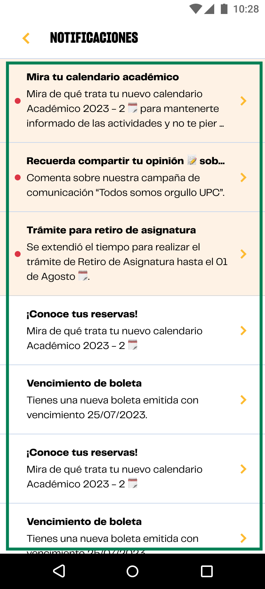

# Guía Visual: list_item_notification
**Payload General:** [../01-home/02-notificaciones/list_item_notification.yaml](../01-home/02-notificaciones/list_item_notification.yaml)

---
## Instancia: list_item_notification
- **Descripción:** Cada vez que el usuario haga click en algún elemento de la lista de notificaciones dentro del app.



**Data Layer (Payload):**
```yaml
{
  "event"       : "ui_interaction",            # Nombre fijo del evento
  "ui_location" : "list_view",                 # Dónde está el elemento
  "ui_element"  : "list_item",                 # Qué es el elemento
  "ui_action"   : "click",                     # Qué hace (open_modal, navigation, etc.)
  "ui_label"    : "{{notification_title}}",    # Esto debe enviar el texto principal del elemento.
  "ui_hierarchy": "inicio > notificaciones",   # Identificador semantico de la seccion donde se ubica.
  "link_url"    : "{{url_destino}}"             # Si te dirige hacia algun otro lugar, abre algun modal o cambia de vista o pagina web.
}
```
