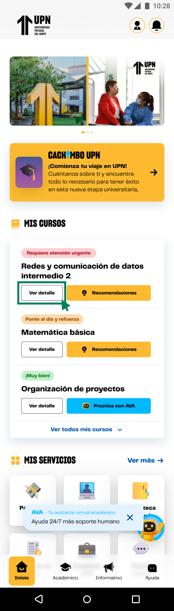

# Guía Visual: button_ver_detalle
**Payload General:** [../01-home/04-mis-cursos/button_ver_detalle.yaml](../01-home/04-mis-cursos/button_ver_detalle.yaml)

---
## Instancia: button_ver_detalle
- **Descripción:** Click en el botón ver detalle del curso desde el home. - `button_ver_recomendaciones`: [payload](./01-home/01-brilla_con-upn/button_enlace.yaml) *(Nota: Revisa si este enlace es correcto, actualmente apunta a la carpeta de Brilla)*.



**Data Layer (Payload):**
```yaml
{
  "event"       : "ui_interaction",                            # Nombre fijo del evento
  "ui_location" : "content_body",                              # Dónde está el elemento
  "ui_element"  : "button",                                    # Qué es el elemento
  "ui_action"   : "click",                                     # Qué hace (open_modal, navigation, etc.)
  "ui_label"    : "ver_detalle",                               # Identificador único o texto del elemento
  "ui_hierarchy": "inicio > mis_cursos > {{recurso_label}}",   # Identificador semantico de la seccion donde se ubica.
  "link_url"    : "{{url_destino}}"                            # Si te dirige hacia algun otro lugar, abre algun modal o cambia de vista o pagina web.
}
```
