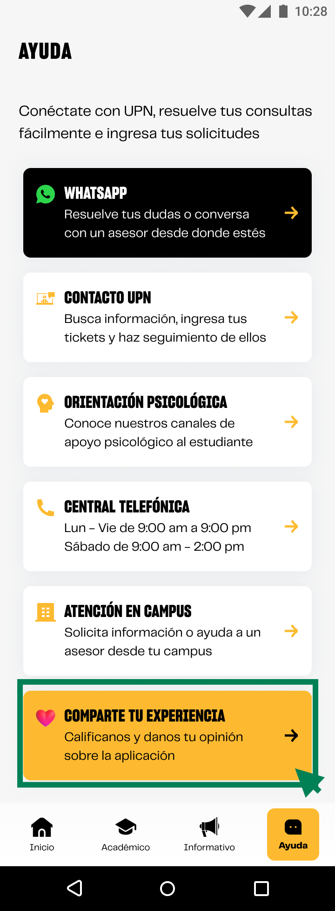

# Guía Visual: button_calificar_tiendas
**Payload General:** [../05-ayuda/button_calificar_tiendas.yaml](../05-ayuda/button_calificar_tiendas.yaml)

---
## Instancia: button_calificar_tiendas
- **Descripción:** Enviar calificación del app a las tiendas (Store).



**Data Layer (Payload):**
```yaml
{
  "event"       : "ui_interaction",         # Nombre fijo del evento
  "ui_location" : "content_body",           # Dónde está el elemento
  "ui_element"  : "button",                 # Qué es el elemento
  "ui_action"   : "click",                  # Qué hace (open_modal, navigation, etc.)
  "ui_label"    : "calificar_en_tiendas",   # Identificador único o texto del elemento
  "ui_hierarchy": "ayuda > csat",           # Identificador semantico de la seccion donde se ubica.
  "link_url"    : "{{url_destino}}"         # Si te dirige hacia algun otro lugar, abre algun modal o cambia de vista o pagina web.
}
```
