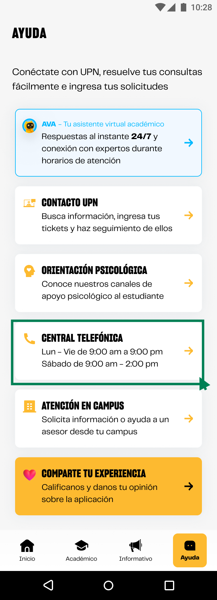

# Guía Visual: card_central_telefonica
**Payload General:** [../05-ayuda/card_central_telefonica.yaml](../05-ayuda/card_central_telefonica.yaml)

---
## Instancia: card_central_telefonica
- **Descripción:** Click en el card de Central Telefónica en la sección Ayuda.



**Data Layer (Payload):**
```yaml
{
  "event"       : "ui_interaction",       # Nombre fijo del evento
  "ui_location" : "content_body",         # Dónde está el elemento
  "ui_element"  : "card",                 # Qué es el elemento
  "ui_action"   : "click",                # Qué hace (open_modal, navigation, etc.)
  "ui_label"    : "central_telefonica",   # Esto debe enviar el texto principal del elemento
  "ui_hierarchy": "ayuda",                # Identificador semantico de la seccion donde se ubica.
  "link_url"    : "{{url_destino}}"        # Si te dirige hacia algun otro lugar, abre algun modal o cambia de vista o pagina web.
}
```
