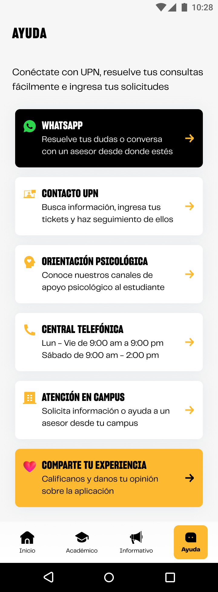

# Guía Visual: screen_view
**Payload General:** [../05-ayuda/screen_view.yaml](../05-ayuda/screen_view.yaml)

---
## Instancia: screen_view
- **Descripción:** Carga de la pantalla del menú de ayuda.



**Data Layer (Payload):**
```yaml
{
  "event"         : "screen_view",   # Nombre unificado del evento
  "screen_name"   : "menu_ayuda",    # Nombre legible (Ej: "Home", "Zona cachimbos")
  "screen_type"   : "dashboard",     # Tipo técnico de la pantalla
  "screen_section": "support",         # Agrupación temática macro (Content Group)
  "category_l1"   : null,
  "category_l2"   : null,
  "category_l3"   : null,
  "entity_id"     : null,            # (Opcional) ID del producto/post/item
  "entity_name"   : null,            # (Opcional) Nombre de la entidad principal
  "search_term"   : null,            # (Opcional) Lo que escribió el usuario
  "result_count"  : null             # (Opcional) Cantidad de resultados encontrados
}
```
