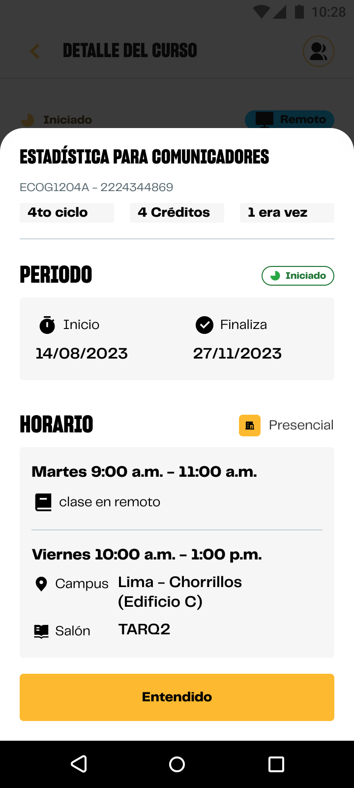

# Guía Visual: modal_info_curso
**Payload General:** [../06-academico/00-cursos/modal_info_curso.yaml](../06-academico/00-cursos/modal_info_curso.yaml)

---
## Instancia: modal_info_curso
- **Descripción:** Interacción con "ver más detalles" del curso.



**Data Layer (Payload):**
```yaml
{
  "event"       : "ui_interaction",                    # Nombre fijo del evento
  "ui_location": "modal_window",                         # Dónde está el elemento
  "ui_element"  : "modal_window",                      # Qué es el elemento
  "ui_action"   : "open_modal",                        # Qué hace (open_modal, navigation, etc.)
  "ui_label"    : "{{cod_curso}} > {{curso_label}}",   # Esto debe enviar el texto principal del elemento
  "ui_hierarchy": "academico > cursos",                # Identificador semantico de la seccion donde se ubica.
  "link_url"    : "{{url_destino}}"                     # Si te dirige hacia algun otro lugar, abre algun modal o cambia de vista o pagina web.
}
```
