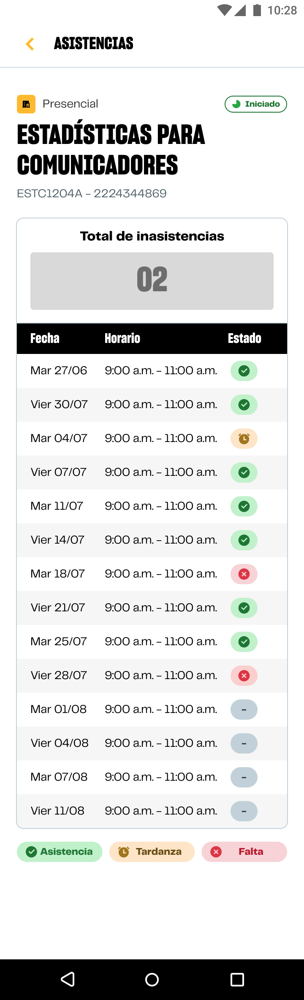

# Guía Visual: screen_view_attendance
**Payload General:** [../06-academico/00-cursos/screen_view_attendance.yaml](../06-academico/00-cursos/screen_view_attendance.yaml)

---
## Instancia: screen_view_attendance
- **Descripción:** Visualización del seguimiento de asistencias.



**Data Layer (Payload):**
```yaml
{
  "event"         : "screen_view",                            # Nombre unificado del evento
  "screen_name"   : "asistencias",                            # Nombre del curso separado por guinos abajo: matematica_aplica_i, estadistica_y_probabilidades
  "screen_type"   : "dashboard",                              # Tipo técnico de la pantalla
  "screen_section": "academico > cursos > {{curso_label}}",   # Agrupación temática macro (Content Group)
  "category_l1"   : null,
  "category_l2"   : null,
  "category_l3"   : null,
  "entity_id"     : null,                                     # (Opcional) ID del producto/post/item
  "entity_name"   : null,                                     # (Opcional) Nombre de la entidad principal
  "search_term"   : null,                                     # (Opcional) Lo que escribió el usuario
  "result_count"  : null                                      # (Opcional) Cantidad de resultados encontrados
}
```
