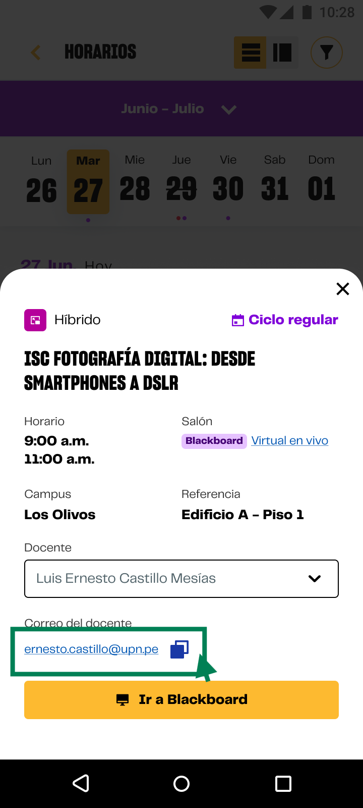

# Guía Visual: link_buzon_msj
**Payload General:** [../06-academico/01-horarios/link_buzon_msj.yaml](../06-academico/01-horarios/link_buzon_msj.yaml)

---
## Instancia: link_buzon_msj
- **Descripción:** El usuario se dirige al buzón de mensajes del curso.



**Data Layer (Payload):**
```yaml
{
  "event"       : "ui_interaction",                   # Nombre fijo del evento
  "ui_location" : "content_body",                     # Dónde está el elemento
  "ui_element"  : "link",                             # Qué es el elemento
  "ui_action"   : "click",                            # Qué hace (open_modal, navigation, etc.)
  "ui_label"    : "link_buzon_msj > {{cod_curso}}",   # Esto debe enviar el texto principal del card
  "ui_hierarchy": "academico > horarios",             # Identificador semantico de la seccion donde se ubica.
  "link_url"    : "{{url_desino}}",                   # Si te dirige hacia algun otro lugar, abre algun modal o cambia de vista o pagina web.
}
```
