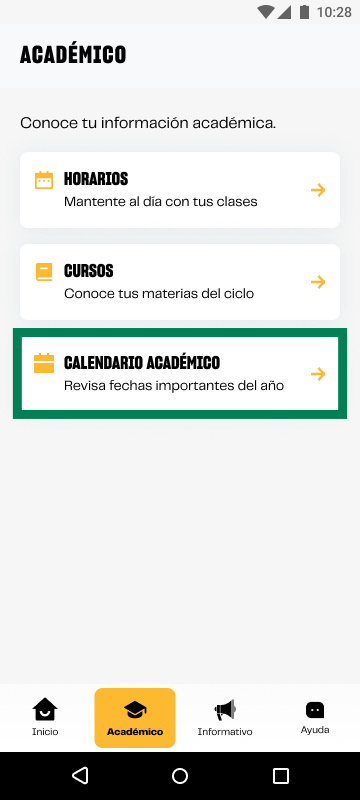

# Guía Visual: card_calendario
**Payload General:** [../06-academico/card_calendario.yaml](../06-academico/card_calendario.yaml)

---
## Instancia: card_calendario
- **Descripción:** Este evento se activa al interactuar con el elemento correspondiente.



**Data Layer (Payload):**
```yaml
{
  "event"       : "ui_interaction",         # Nombre fijo del evento
  "ui_location" : "content_body",           # Dónde está el elemento
  "ui_element"  : "card",                   # Qué es el elemento
  "ui_action"   : "click",                  # Qué hace (open_modal, navigation, etc.)
  "ui_label"    : "calendario_academico",   # Esto debe enviar el texto principal del elemento
  "ui_hierarchy": "academico",              # Identificador semantico de la seccion donde se ubica.
  "link_url"    : "{{url_desino}}"          # Si te dirige hacia algun otro lugar, abre algun modal o cambia de vista o pagina web.
}
```
