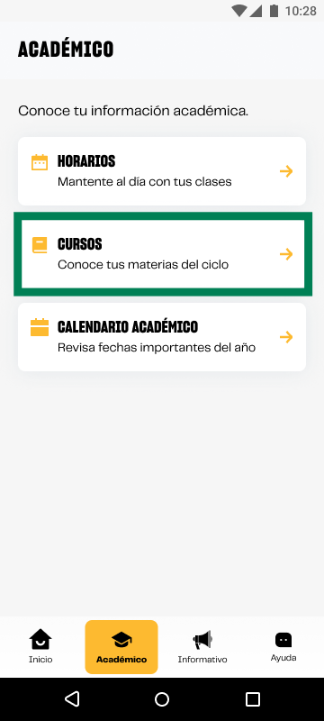

# Guía Visual: card_cursos
**Payload General:** [../06-academico/card_cursos.yaml](../06-academico/card_cursos.yaml)

---
## Instancia: card_cursos
- **Descripción:** Este evento se activa al interactuar con el elemento correspondiente.



**Data Layer (Payload):**
```yaml
{
  "event"       : "ui_interaction",   # Nombre fijo del evento
  "ui_location" : "content_body",     # Dónde está el elemento
  "ui_element"  : "card",             # Qué es el elemento
  "ui_action"   : "click",            # Qué hace (open_modal, navigation, etc.)
  "ui_label"    : "cursos",           # Esto debe enviar el texto principal del elemento
  "ui_hierarchy": "academico",        # Identificador semantico de la seccion donde se ubica.
  "link_url"    : "{{url_desino}}"    # Si te dirige hacia algun otro lugar, abre algun modal o cambia de vista o pagina web.
}
```
