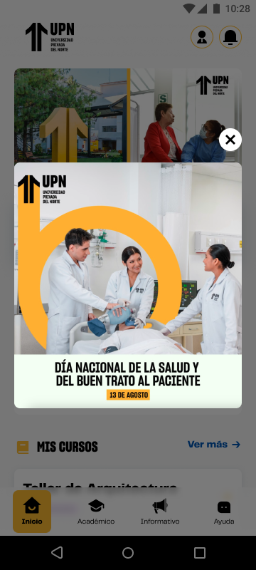

# Guía Visual: popup_view
**Payload General:** [../07-modals/popup_view.yaml](../07-modals/popup_view.yaml)

---
## Instancia: popup_view
- **Descripción:** Permite capturar qué elementos popup se han mostrado al estudiante.



**Data Layer (Payload):**
```yaml
{
  "event"       : "ui_interaction",    # Nombre fijo del evento
  "ui_location" : "home",              # Dónde está el elemento
  "ui_element"  : "modal_window",      # Qué es el elemento
  "ui_action"   : "impression",        # Qué hace (open_modal, navigation, etc.)
  "ui_label"    : "{{modal_label}}",   # Esto debe enviar el texto principal del elemento
  "ui_hierarchy": "inicio",            # Identificador semantico de la seccion donde se ubica.
  "link_url"    : "{{url_desino}}"     # Si te dirige hacia algun otro lugar, abre algun modal o cambia de vista o pagina web.
}
```
