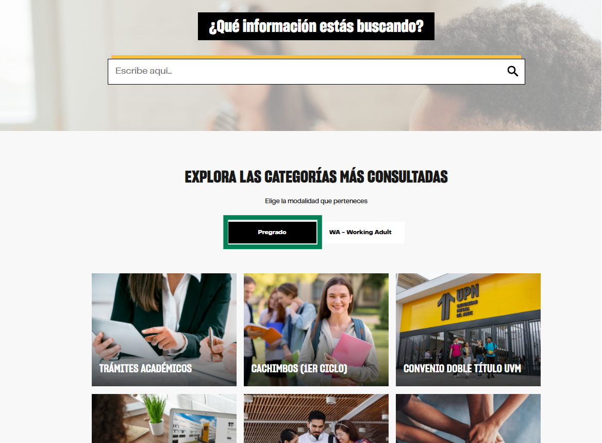

# Guía Visual: button_pregrado
**Payload General:** [../00-home/button_pregrado.yaml](../00-home/button_pregrado.yaml)

---
## Instancia: button_pregrado
- **Descripción:** Captura la intención de interés en la oferta académica de pregrado.



**Data Layer (Payload):**
```yaml
{
  "event"       : "ui_interaction",    # Nombre fijo del evento
  "ui_location" : "content_body",      # Dónde está el elemento
  "ui_element"  : "button",            # Qué es el elemento
  "ui_action": "filter_apply",             # Qué hace (open_modal, navigation, etc.)
  "ui_label"    : "pregrado",          # Identificador único o texto del elemento
  "ui_hierarchy": "home",              # Identificador semantico de la seccion donde se ubica.
  "link_url"    : "{{url_destino}}"
# Si te dirige hacia algun otro lugar, abre algun modal o cambia de vista o pagina web.}
```
