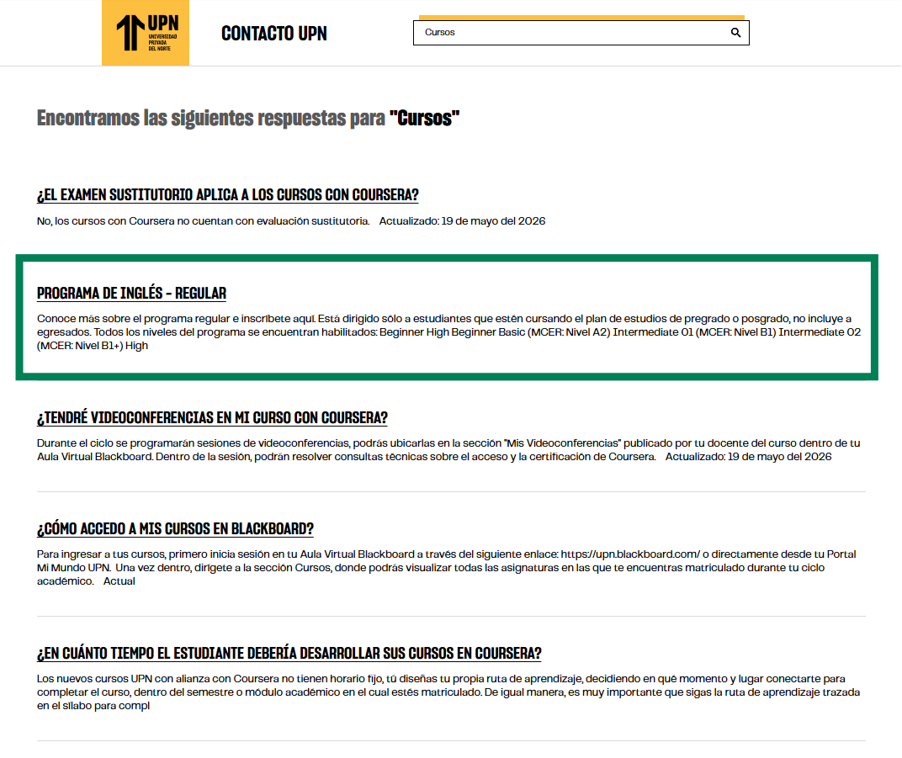

# Guía Visual: list_item_search
**Payload General:** [../01-search/list_item_search.yaml](../01-search/list_item_search.yaml)

---
## Instancia: list_item_search
- **Descripción:** **Click en Resultado.** Se dispara cuando el usuario selecciona uno de los enlaces resultantes de la búsqueda. *Objetivo:* Capturar el título de la sección seleccionada para determinar la relevancia de los resultados entregados.



**Data Layer (Payload):**
```yaml
{
  "event"       : "ui_interaction",   # Nombre fijo del evento
  "ui_location" : "list_view",        # Dónde está el elemento
  "ui_element"  : "list_item",        # Qué es el elemento
  "ui_action"   : "click",            # Qué hace (open_modal, navigation, etc.)
  "ui_label"    : "{{label}}",        # Esto debe enviar el texto principal del elemento
  "ui_hierarchy": "home > search",    # Identificador semantico de la seccion donde se ubica.
  "link_url"    : "{{url_desino}}",   # Si te dirige hacia algun otro lugar, abre algun modal o cambia de vista o pagina web.
}
```
