# Guía Visual de Marcación - Prospección Colegios UPC

Este documento contiene las referencias visuales (pantallas) para cada uno de los **37 eventos** del plan de marcación enumerados. Las imágenes deben guardarse en la carpeta `assets/` en formato `.png` con el nombre exacto que se indica en cada apartado.

---

## 📝 02 - Registro

### Evento: `enviar_solicitud`
- **Payload:** [00-registro/tus_planes.yaml](./00-registro/tus_planes.yaml)
- **Descripción:** Este evento sale cuando se envian los datos principales de la encuesta dentro del proceso de Registro.

#### Tus Planes - ¿Que tal vas con el tema de la universidad?
- **Descripción:** Este evento se envía cuando el usuario hace clic en el boton "Continuar" dentro del paso "¿Que tal vas con el tema de la universidad?" del formulario de registro.

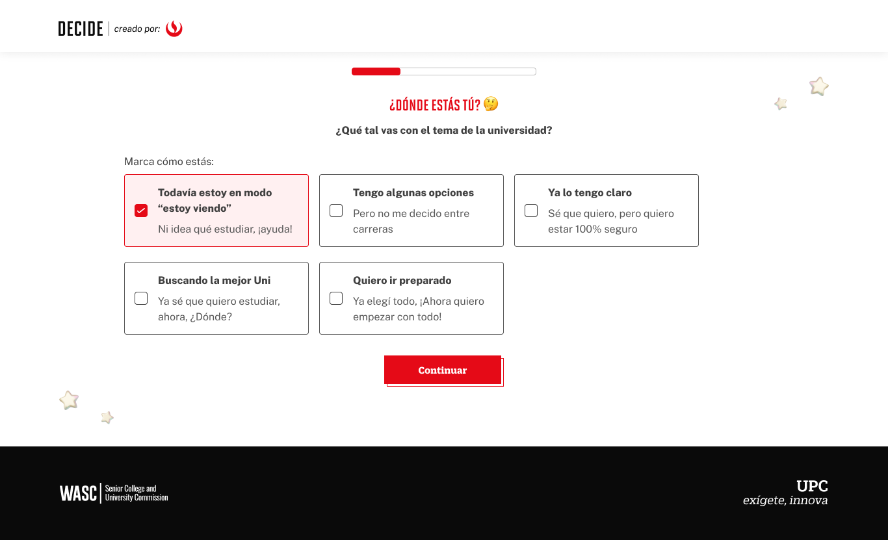

**Data Layer (Payload):**
```yaml
{
  "event"          : "ui_interaction", 
  "ui_location"    : "content_body",          
  "ui_element"     : "button",                  
  "ui_action"      : "click",                         
  "ui_label"       : "continuar",                       
  "ui_hierarchy"   : "home > registro > donde estas",                 
  "path_location"  : "/registro/donde-estas-tu",           # Path de donde se mide el evento.
  "data_collected" : "Ni idea que estudiar",               # Se envían las opciones que elige en el formulario, en este caso es "Ni idea que estudiar", como indica la imagen de ejemplo.
}
```

#### Tus Planes - ¿Que Carrera Tienes en Mente?
- **Descripción:** Este evento se envía cuando el usuario hace clic en el boton "Continuar" dentro del paso "¿Que Carrera Tienes en Mente?" del formulario de registro.

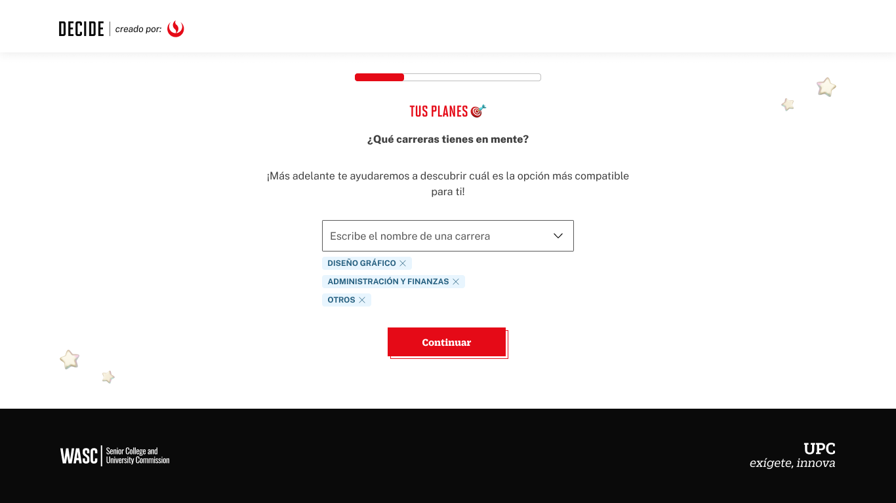

**Data Layer (Payload):**
```yaml
{
  "event"          : "ui_interaction", 
  "ui_location"    : "content_body",          
  "ui_element"     : "button",                  
  "ui_action"      : "click",                         
  "ui_label"       : "continuar",                       
  "ui_hierarchy"   : "home > registro > tus_planes",                 
  "path_location"  : "/registro/tus-planes/carrera",                     # Path de donde se mide el evento.
  "data_collected" : "Diseño Gráfico|Administración y Finanzas|Otros",   # Se envían las opciones de las carreras que coloca en el formulario separadas con el símbolo "|" por cada opción, en este caso son esas 3 opciones "(Diseño Gráfico, Administración y Finanzas, Finanzas)" como indica la imagen de ejemplo.
}
```

#### Tus Planes - ¿Donde quieres estudiar?
- **Descripción:** Este evento se envía cuando el usuario hace clic en el boton "Continuar" dentro del paso "¿Donde quieres estudiar?" del formulario de registro.

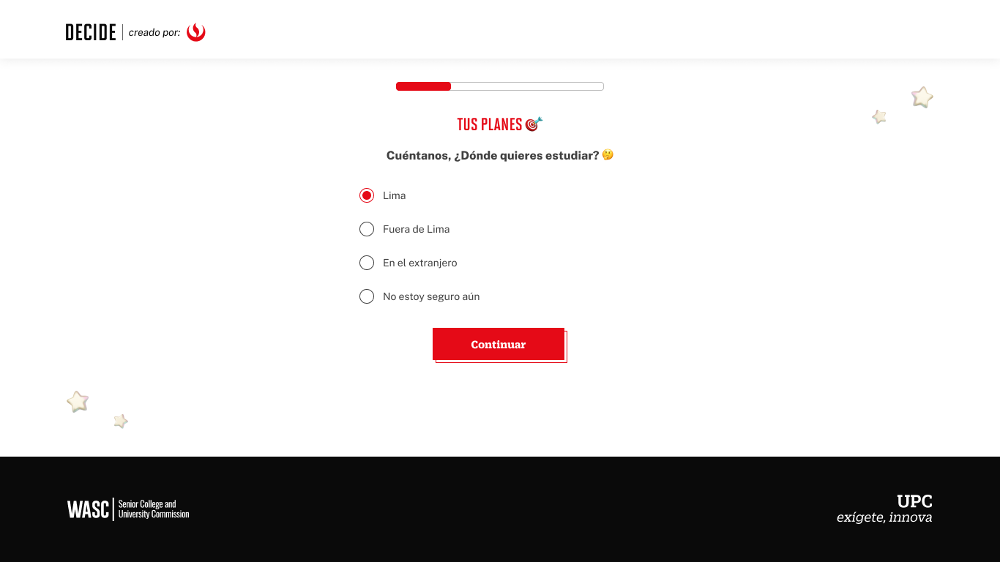

**Data Layer (Payload):**
```yaml
{
  "event"          : "ui_interaction", 
  "ui_location"    : "content_body",          
  "ui_element"     : "button",                  
  "ui_action"      : "click",                         
  "ui_label"       : "continuar",                       
  "ui_hierarchy"   : "home > registro > tus_planes",                 
  "path_location"  : "/registro/tus-planes/donde-estudiar",     # Path de donde se mide el evento.           
  "data_collected" : "Lima",                                    # Se envían las opciones que elige en el formulario, en este caso es "Lima", como indica la imagen de ejemplo.
}
```

#### Tus Planes - ¿En que modalidad quieres estudiar?
- **Descripción:** Este evento se envía cuando el usuario hace clic en el boton "Continuar" dentro del paso "¿En que modalidad quieres estudiar?" del formulario de registro.

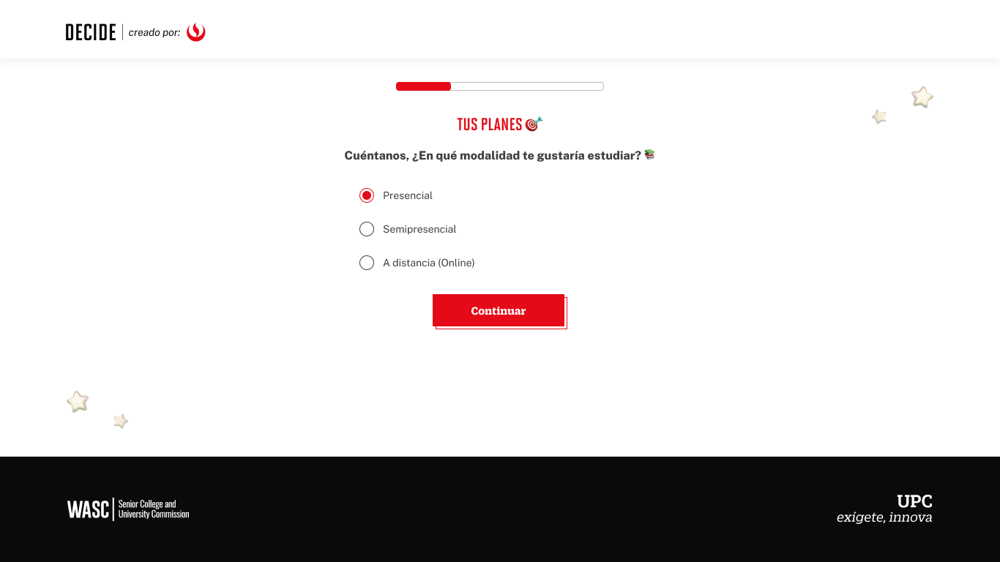

**Data Layer (Payload):**
```yaml
{
  "event"          : "ui_interaction", 
  "ui_location"    : "content_body",          
  "ui_element"     : "button",                  
  "ui_action"      : "click",                         
  "ui_label"       : "continuar",                       
  "ui_hierarchy"   : "home > registro > tus_planes",                 
  "path_location"  : "/registro/tus-planes/modalidad",   # Path de donde se mide el evento.             
  "data_collected" : "Presencial",                       # Se envían las opciones que elige en el formulario, en este caso es "Presencial", como indica la imagen de ejemplo.
}
```

#### Tus Planes - ¿Que universidad tienes en mente?
- **Descripción:** Este evento se envía cuando el usuario hace clic en el boton "Continuar" dentro del paso "¿Que universidad tienes en mente?" del formulario de registro.

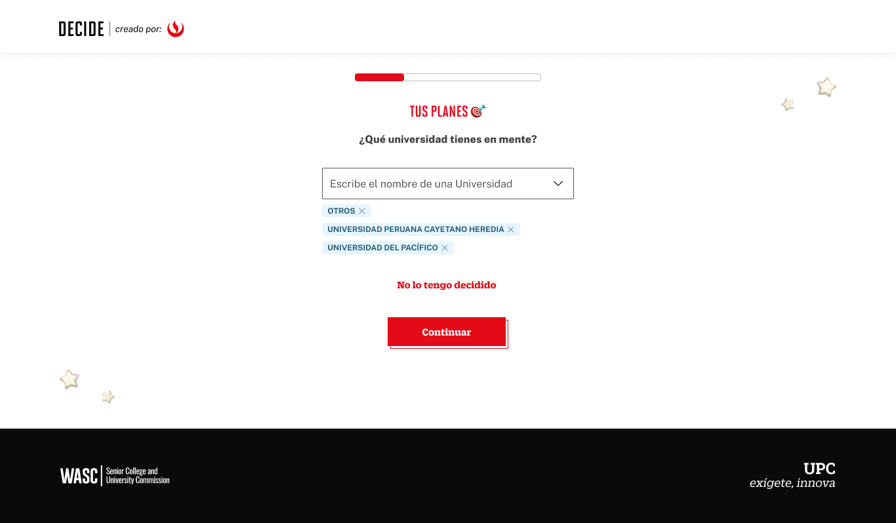

**Data Layer (Payload):**
```yaml
{
  "event"          : "ui_interaction", 
  "ui_location"    : "content_body",          
  "ui_element"     : "button",                  
  "ui_action"      : "click",                         
  "ui_label"       : "continuar",                       
  "ui_hierarchy"   : "home > registro > tus_planes",                 
  "path_location"  : "/registro/tus-planes/modalidad",                                         # Path de donde se mide el evento.            
  "data_collected" : "Universidad Peruana Cayetano Heredia|Universidad del Pacifico|Otros"     # Se envían las opciones de las universidades que coloca en el formulario separadas con el símbolo "|" por cada opción, en este caso son esas 3 opciones "(Universidad Peruana Cayetano Heredia, Universidad del Pacifico, Otros)" como indica la imagen de ejemplo.
}
```

### Evento: `registro_exitoso`
- **Payload:** [00-registro/registro_exitoso.yaml](./00-registro/registro_exitoso.yaml)
- **Descripción:** Este evento se envía cuando se crea un Registro en la Plataforma, cuando se llena el Formulario de identificación. (Como indica la imagen)

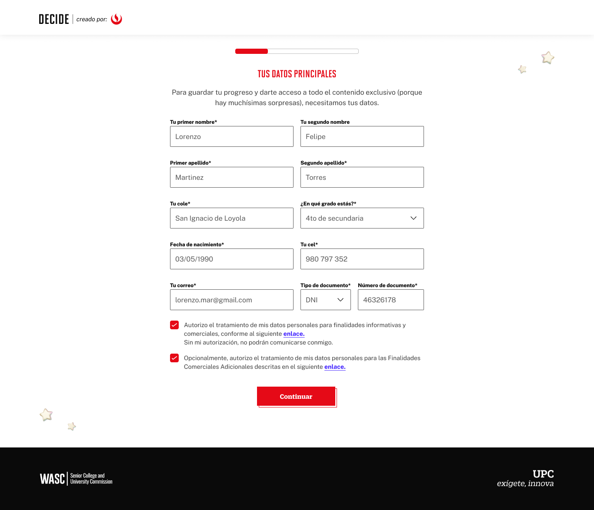

**Data Layer (Payload):**
```yaml
{
  "event"          : "ui_interaction",                               
  "ui_location"    : "screen_view",                                  
  "ui_element"     : "button",                                       
  "ui_action"      : "submit",                                       
  "ui_label"       : "registro_exitoso",                             
  "ui_hierarchy"   : "home > registro",                              
  "path_location"  : "/registro/datos-personales",            # Path de donde se mide el evento.
  "user_code"      : "{{id_usuario}}"                         # Código de usuario (alumno o prospecto, código de HubSpot)
}
```

### Evento: `ingresar`
- **Payload:** [00-registro/login.yaml](./00-registro/login.yaml)
- **Descripción:** Este evento cuando te logueas, cuando ya te registraste.


**Data Layer (Payload):**
```yaml
{
  "event"          : "ui_interaction",                               
  "ui_location"    : "screen_view",                                  
  "ui_element"     : "button",                                      
  "ui_action"      : "submit",                                       
  "ui_label"       : "login",                                        
  "ui_hierarchy"   : "home > login",                              
  "path_location"  : "/iniciar-sesion",                   # Path de donde se mide el evento.
  "user_code"      : "{{id_usuario}}"                     # Código de usuario (alumno o prospecto, código de HubSpot)
}
```

### Evento: `entendido_error`
- **Payload:** [00-registro/registro_error.yaml](./00-registro/registro_error.yaml)
- **Descripción:** Este evento sale cuando "Sale Error" en el proceso de Registro.

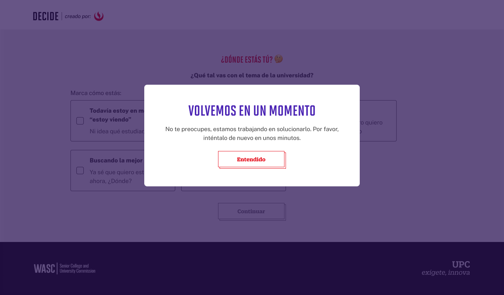

**Data Layer (Payload):**
```yaml
{
  "event"            : "ui_interaction",                             
  "ui_location"      : "screen_view",                                
  "ui_element"       : "modal_window",                               
  "ui_action"        : "impression",                                 
  "ui_label"         : "error",                                      
  "ui_hierarchy"     : "home > registro",                            
  "path_location"    : "{{path_actual_del_evento}}",           # Path de donde se mide el evento.
  "data_collected"   : "{{data_recopilada}}",                  # Mensaje de error que se muestra en el mensaje.
}
```

---

## 🎮 03 - Nivel 1 - Preguntas AutoConocimiento

### Evento: `comenzar_la_aventura`
- **Payload:** [01-nivel1/inicio.yaml](./01-nivel1/inicio.yaml)
- **Descripción:** Clic al botón Comenzar la Aventura, de las Preguntas de Autoconocimiento.

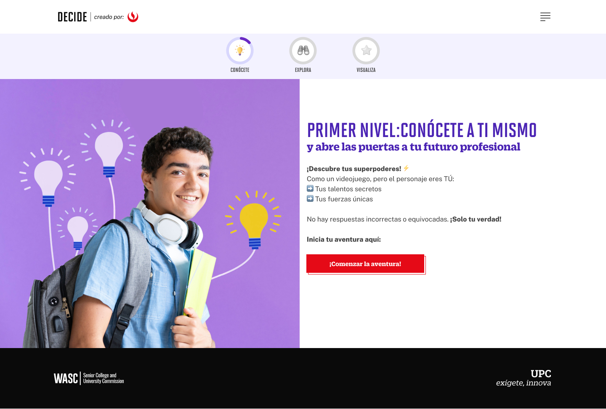

**Data Layer (Payload):**
```yaml
{
  "event"              : "ui_interaction",                           
  "ui_location"        : "content_body",                             
  "ui_element"         : "button",                                   
  "ui_action"          : "click",                                    
  "ui_label"           : "comenzar_la_aventura",                                   
  "ui_hierarchy"       : "home > nivel1",                            
  "path_location"      : "/conocete",                  # Path de donde se mide el evento.     
}
```


### Evento: `siguiente`
- **Payload:** [01-nivel1/preguntas.yaml](./01-nivel1/preguntas.yaml)
- **Descripción:** Este evento mide cuando se envian las respuestas de las Preguntas de Autoconocimiento.


**Data Layer (Payload):**
```yaml
{
  "event"              : "ui_interaction",                           
  "ui_location"        : "content_body",                             
  "ui_element"         : "button",                                  
  "ui_action"          : "submit",                                   
  "ui_label"           : "{{nombre_del_boton}}",                 # Identificador único o texto del elemento, depende de la pregunta. Para el caso de la imagen de ejemplo es "Vamos por más".
  "ui_hierarchy"       : "home > nivel1 > Pregunta[1-3]",        # Identificador semántico de la sección donde se ubica. (En este caso es Nivel 1, acompañado por el número de pregunta que se responde).
  "path_location"      : "/conocete/encuesta?pregunta=[1-3]",    # Path de donde se mide el evento. En este caso se mide por el número de preguntas, para este caso son 3 preguntas.
  "data_collected"     : "{{data_recopilada}}",                  # Se guarda lo que llena el usuario.
}
```

### Evento: `excelente`
- **Payload:** [01-nivel1/fin.yaml](./01-nivel1/fin.yaml)
- **Descripción:** Clic al botón "Excelente", en las Preguntas de Autoconocimiento. Que indica la finalización del módulo.

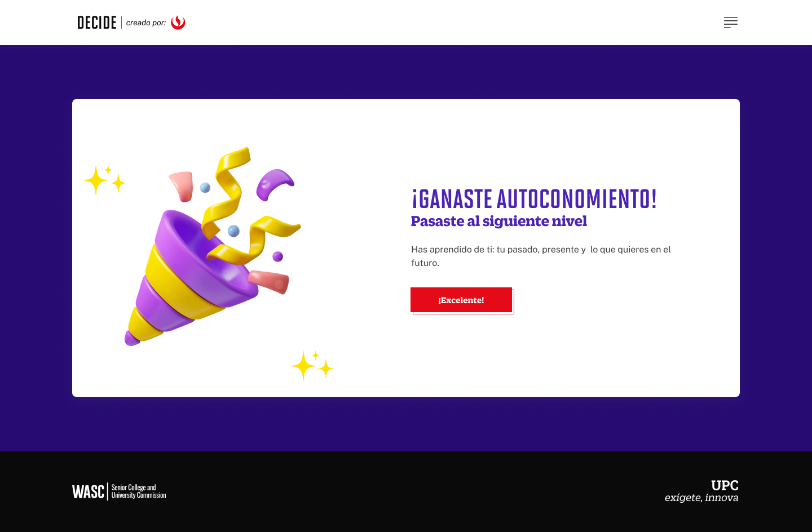

**Data Layer (Payload):**
```yaml
{
  "event"              : "ui_interaction",                           
  "ui_location"        : "content_body",                             
  "ui_element"         : "button",                                   
  "ui_action"          : "click",                                    
  "ui_label"           : "excelente",                                # Identificador único o texto del elemento. (En este caso es "Excelente").
  "ui_hierarchy"       : "home > nivel1",                            # Identificador semántico de la sección donde se ubica. (En este caso es Nivel 1)
  "path_location"      : "/conocete/exito",                          # Path de donde se mide el evento.
}
```


### Evento: `seguimiento_error`
- **Payload:** [01-nivel1/error.yaml](./01-nivel1/error.yaml)
- **Descripción:** Este evento mide cuando hay un error al enviar las respuestas de las Preguntas de Autoconocimiento.


**Data Layer (Payload):**
```yaml
{
  "event"              : "ui_interaction",                          
  "ui_location"        : "navigation",                               
  "ui_element"         : "modal_window",                             
  "ui_action"          : "impression",                               
  "ui_label"           : "error",                                 # Identificador único o texto del elemento. (En este caso es "Error").
  "ui_hierarchy"       : "{{Sección donde se da el error}}",      # Identificador semántico de la sección donde se ubica.
  "path_location"      : "{{path_actual_del_evento}}",            # Path de donde se mide el evento.
  "data_collected"     : "{{data_recopilada}}",                   # Error que se muestra en el mensaje.
}
```

---

## 🧠 03 - Test de Autoconocimiento (Conócete)

### Evento: `comenzar_el_test`
- **Payload:** [02-test-autoconocimiento/inicio.yaml](./02-test-autoconocimiento/inicio.yaml)
- **Descripción:** Clic al botón "Comenzar el Test", en el Test de Autoconocimiento.


**Data Layer (Payload):**
```yaml
{
  "event"              : "ui_interaction",                           
  "ui_location"        : "content_body",                             
  "ui_element"         : "button",                                   
  "ui_action"          : "click",                                    
  "ui_label"           : "comenzar_el_test",                # Identificador único o texto del elemento. (En este caso es "Comenzar el Test").
  "ui_hierarchy"       : "home > autoconocimiento",         # Identificador semántico de la sección donde se ubica. (En este caso es autoconocimiento).
  "path_location"      : "/conocete/test-vocacional",       # Path de donde se mide el evento.
}
```

### Evento: `seguimos`
- **Payload:** [02-test-autoconocimiento/preguntas.yaml](./02-test-autoconocimiento/preguntas.yaml)
- **Descripción:** Clic al botón "Seguimos", en el Test de Autoconocimiento. Para todas las 100 preguntas.

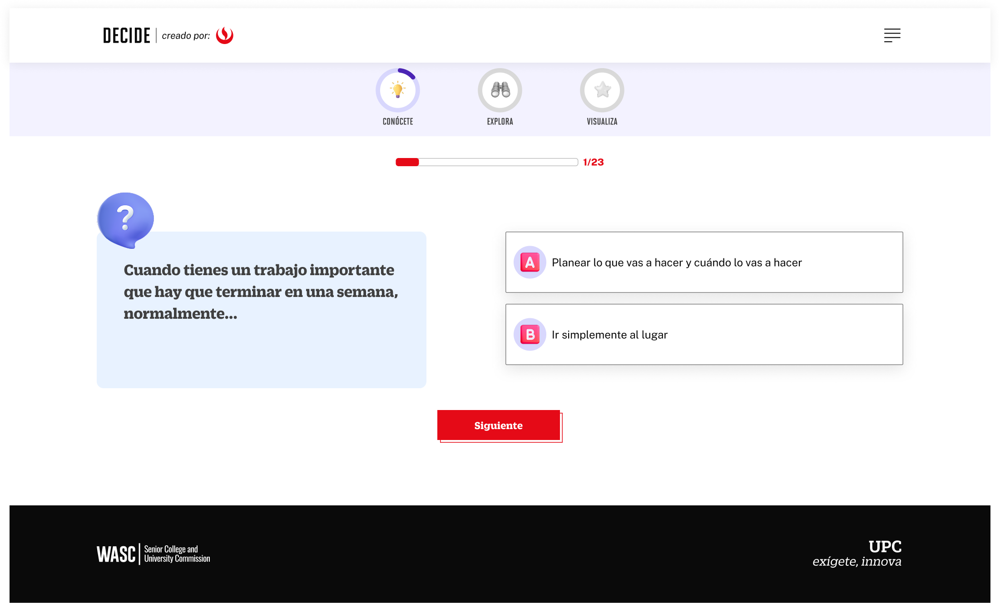

**Data Layer (Payload):**
```yaml
{
  "event"              : "ui_interaction",                           
  "ui_location"        : "content_body",                             
  "ui_element"         : "button",                                   
  "ui_action"          : "submit",                                   
  "ui_label"           : "{{numero_de_pregunta}}",                    # Identificador único o texto del elemento, en este caso debe ir el número de la pregunta que se responde. Ejemplo 1,2,3, etc.
  "ui_hierarchy"       : "home > autoconocimiento > pregunta[1-98]",  # Identificador semántico de la sección donde se ubica. (En este caso es autoconocimiento > acompañado por el número de pregunta que se responde).
  "path_location"      : "/conocete/encuesta?pregunta=[1-98]",        # Path de donde se mide el evento.En este caso se mide por el número de preguntas, para este caso son 98 preguntas.
  "data_collected"     : "{{data_recopilada}}",                       # Se guarda lo que llena el usuario.
}
```


### Evento: `no mucho`
- **Payload:** [02-test-autoconocimiento/valoracion_carreras.yaml](./02-test-autoconocimiento/valoracion_carreras.yaml)
- **Descripción:** Clic al botón "No" o "Si" para las carreras que la IA propone.


**Data Layer (Payload):**
```yaml
{
  "event"              : "ui_interaction",                          
  "ui_location"        : "content_body",                             
  "ui_element"         : "button",                                   
  "ui_action"          : "click",                                    
  "ui_label"           : "{{si|no}}",                                      # Identificador único o texto del elemento, depende de la pregunta. (En este caso es "Sí" o "No").
  "ui_hierarchy"       : "home > autoconocimiento > valoracion_carreras",  # Identificador semántico de la sección donde se ubica. (En este caso es autoconocimiento > valoración de carreras).
  "path_location"      : "/conocete/test-vocacional/carreras",             # Path de donde se mide el evento.
  "data_collected"     : "{{data_recopilada}}",                            # Aquí debe ir la carrera que es aceptada o rechazada. (Odontología, Derecho, etc.).
}
```

### Evento: `finaliza_nivel`
- **Payload:** [02-test-autoconocimiento/fin.yaml](./02-test-autoconocimiento/fin.yaml)
- **Descripción:** Este evento mide cuando se termina el Test de Autoconocimiento.


**Data Layer (Payload):**
```yaml
{
  "event"              : "ui_interaction",                           
  "ui_location"        : "content_body",                             
  "ui_element"         : "button",                                   
  "ui_action"          : "click",                                    
  "ui_label"           : "exito",                                    # Identificador único o texto del elemento. (En este caso es "Éxito").
  "ui_hierarchy"       : "home > autoconocimiento",                  # Identificador semántico de la sección donde se ubica. (En este caso es autoconocimiento)
  "path_location"      : "/conocete/test-vocacional/exito",          # Path de donde se mide el evento.
}
```

### Evento: `enviar_resultados_whatsapp`
- **Payload:** [02-test-autoconocimiento/enviar_por_whatsapp.yaml](./02-test-autoconocimiento/enviar_por_whatsapp.yaml)
- **Descripción:** Clic al botón "Enviar Resultados por WhatsApp" en el Modal de descarga, en el Test de Autoconocimiento.


**Data Layer (Payload):**
```yaml
{
  "event"              : "ui_interaction",                          
  "ui_location"        : "modal_window",                             
  "ui_element"         : "button",                                   
  "ui_action"          : "submit",                                   
  "ui_label"           : "enviar_por_whatssapp",                                 # Identificador único o texto del elemento. (En este caso es "Enviar por WhatsApp").
  "ui_hierarchy"       : "home > autoconocimiento",                              # Identificador semántico de la sección donde se ubica. (En este caso es autoconocimiento)
  "path_location"      : "/conocete/test-vocacional/descargar-resultados",       # Path de donde se mide el evento.
}
```

---

## 🤖 04 - Nivel 2 - Explora

### Evento: `explora_vamos`
- **Payload:** [03-niveles-chatbot/inicio.yaml](./03-niveles-chatbot/inicio.yaml)
- **Descripción:** Clic al botón "Vamos", en Nivel Explora.

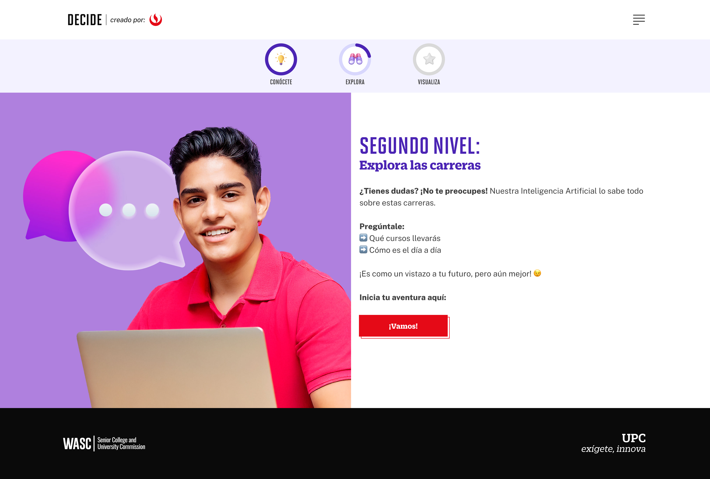

**Data Layer (Payload):**
```yaml
{
  "event"              : "ui_interaction",                           
  "ui_location"        : "content_body",                             
  "ui_element"         : "button",                                   
  "ui_action"          : "click",                                    
  "ui_label"           : "vamos",                       # Identificador único o texto del elemento. (En este caso es "Vamos").
  "ui_hierarchy"       : "home > explora",              # Identificador semántico de la sección donde se ubica. (En este caso es explora)
  "path_location"      : "/explora",                    # Path de donde se mide el evento.
}
```

### Evento: `explora_chatbot`
- **Payload:** [03-niveles-chatbot/chatbot.yaml](./03-niveles-chatbot/chatbot.yaml)
- **Descripción:** Este evento mide las interacciones con la IA de Explora.


**Data Layer (Payload):**
```yaml
{
  "event"              : "ui_interaction",                           
  "ui_location"        : "form_container",                           
  "ui_element"         : "button",                                   
  "ui_action"          : "click",                                   
  "ui_label"           : "ia_chatbot",                               
  "ui_hierarchy"       : "home > explora > chatbot",                 # Identificador semántico de la sección donde se ubica. (En este caso es explora > chatbot)
  "path_location"      : "/explora/chatbot",                         # Path de donde se mide el evento.
  "data_collected"     : "{{data_recopilada}}",                      # Mensaje del Chatbot.
}
```

### Evento: `explora_fin`
- **Payload:** [03-niveles-chatbot/fin.yaml](./03-niveles-chatbot/fin.yaml)
- **Descripción:** Clic al botón "Fin", Nivel Explora


**Data Layer (Payload):**
```yaml
{
  "event"              : "ui_interaction",                   
  "ui_location"        : "content_body",                     
  "ui_element"         : "button",                           
  "ui_action"          : "click",                            
  "ui_label"           : "entendido",                        # Identificador único o texto del elemento. (En este caso es "Entendido").
  "ui_hierarchy"       : "home > explora",                   # Identificador semántico de la sección donde se ubica. (En este caso es explora)
  "path_location"      : "/explora/ganaste-seguridad",       # Path de donde se mide el evento.
}
```

---

## 🤖 05 - Nivel 3 - Visualiza


### Evento: `visualiza_vamos`
- **Payload:** [03-niveles-chatbot/inicio.yaml](./03-niveles-chatbot/inicio.yaml)
- **Descripción:** Clic al botón "Vamos", de Visualiza

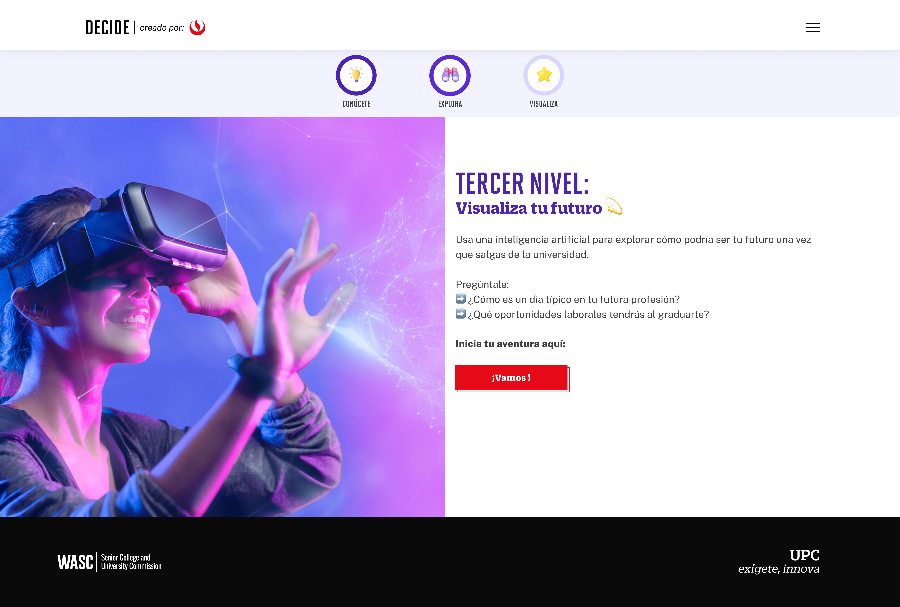

**Data Layer (Payload):**
```yaml
{
  "event"              : "ui_interaction",                           
  "ui_location"        : "content_body",                             
  "ui_element"         : "button",                                   
  "ui_action"          : "click",                                    
  "ui_label"           : "vamos",                       # Identificador único o texto del elemento. (En este caso es "Vamos").
  "ui_hierarchy"       : "home > visualiza",            # Identificador semántico de la sección donde se ubica. (En este caso es visualiza)
  "path_location"      : "/visualiza",                  # Path de donde se mide el evento.
}
```

### Evento: `visualiza_chatbot`
- **Payload:** [03-niveles-chatbot/chatbot.yaml](./03-niveles-chatbot/chatbot.yaml)
- **Descripción:** Este evento mide las interacciones con la IA de Visualiza.


**Data Layer (Payload):**
```yaml
{
  "event"              : "ui_interaction",                           
  "ui_location"        : "form_container",                           
  "ui_element"         : "button",                                   
  "ui_action"          : "click",                                   
  "ui_label"           : "ia_chatbot",                               
  "ui_hierarchy"       : "home > visualiza > chatbot",               # Identificador semántico de la sección donde se ubica. (En este caso es visualiza > chatbot)
  "path_location"      : "/visualiza/chatbot",                       # Path de donde se mide el evento.
  "data_collected"     : "{{data_recopilada}}",                      # Mensaje del Chatbot.
}
```


### Evento: `visualiza_entendido`
- **Payload:** [03-niveles-chatbot/fin.yaml](./03-niveles-chatbot/fin.yaml)
- **Descripción:** Clic al botón "Entendido", de Visualiza


**Data Layer (Payload):**
```yaml
{
  "event"              : "ui_interaction",                   
  "ui_location"        : "content_body",                     
  "ui_element"         : "button",                           
  "ui_action"          : "click",                            
  "ui_label"           : "entendido",                              # Identificador único o texto del elemento. (En este caso es "Entendido").
  "ui_hierarchy"       : "home > visualiza",                       # Identificador semántico de la sección donde se ubica. (En este caso es visualiza)
  "path_location"      : "/visualiza/ganaste-vision-a-futuro",     # Path de donde se mide el evento.
}
```

---

## 🤖 06 - Nivel 4 - Imagina


### Evento: `imagina_comencemos`
- **Payload:** [03-niveles-chatbot/inicio.yaml](./03-niveles-chatbot/inicio.yaml)
- **Descripción:** Clic al botón "Comencemos", de Imagina

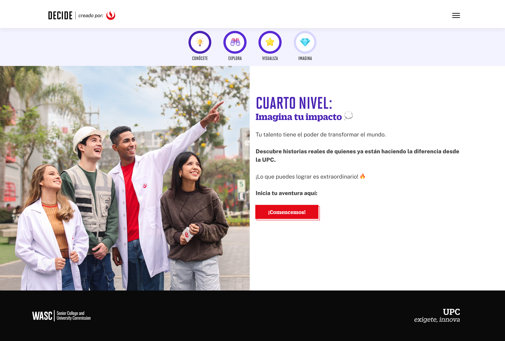

**Data Layer (Payload):**
```yaml
{
  "event"              : "ui_interaction",                           
  "ui_location"        : "content_body",                             
  "ui_element"         : "button",                                   
  "ui_action"          : "click",                                    
  "ui_label"           : "comencemos",                # Identificador único o texto del elemento. (En este caso es "Comencemos").
  "ui_hierarchy"       : "home > imagina",            # Identificador semántico de la sección donde se ubica. (En este caso es imagina)
  "path_location"      : "/imagina",                  # Path de donde se mide el evento.
}
```


### Evento: `imagina_chatbot`
- **Payload:** [03-niveles-chatbot/chatbot.yaml](./03-niveles-chatbot/chatbot.yaml)
- **Descripción:** Este evento mide las interacciones con la IA de Imagina.


**Data Layer (Payload):**
```yaml
{
  "event"              : "ui_interaction",                           
  "ui_location"        : "form_container",                           
  "ui_element"         : "button",                                   
  "ui_action"          : "click",                                   
  "ui_label"           : "ia_chatbot",                               
  "ui_hierarchy"       : "home > imagina > chatbot",               # Identificador semántico de la sección donde se ubica. (En este caso es imagina > chatbot)
  "path_location"      : "/imagina/chatbot",                       # Path de donde se mide el evento.
  "data_collected"     : "{{data_recopilada}}",                    # Mensaje del Chatbot.
}
```

### Evento: `imagina_vamospormas`
- **Payload:** [03-niveles-chatbot/fin.yaml](./03-niveles-chatbot/fin.yaml)
- **Descripción:** Clic al botón "Vamos por más", Nivel Imagina


**Data Layer (Payload):**
```yaml
{
  "event"              : "ui_interaction",                   
  "ui_location"        : "content_body",                     
  "ui_element"         : "button",                           
  "ui_action"          : "click",                            
  "ui_label"           : "vamos_por_mas",                       # Identificador único o texto del elemento. (En este caso es "Vamos por más").
  "ui_hierarchy"       : "home > imagina",                      # Identificador semántico de la sección donde se ubica. (En este caso es imagina)
  "path_location"      : "/imagina/ganaste-inspiracion",        # Path de donde se mide el evento.
}
```

---

## 🤖 07 - Nivel 5 - Globalízate

### Evento: `globalizate_comencemos`
- **Payload:** [03-niveles-chatbot/inicio.yaml](./03-niveles-chatbot/inicio.yaml)
- **Descripción:** Clic al botón "Comencemos", de Globalizate

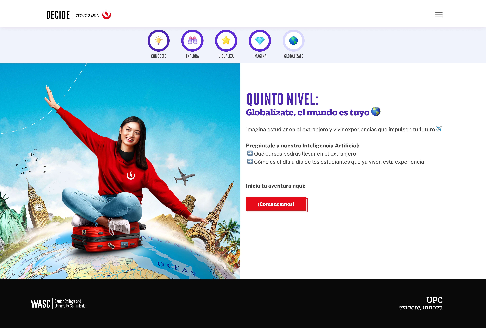

**Data Layer (Payload):**
```yaml
{
  "event"              : "ui_interaction",                           
  "ui_location"        : "content_body",                             
  "ui_element"         : "button",                                   
  "ui_action"          : "click",                                    
  "ui_label"           : "comencemos",                    # Identificador único o texto del elemento. (En este caso es "Comencemos").
  "ui_hierarchy"       : "home > globalizate",            # Identificador semántico de la sección donde se ubica. (En este caso es globalizate)
  "path_location"      : "/globalizate",                  # Path de donde se mide el evento.
}
```

### Evento: `globalizate_chatbot`
- **Payload:** [03-niveles-chatbot/chatbot.yaml](./03-niveles-chatbot/chatbot.yaml)
- **Descripción:** Este evento mide las interacciones con la IA de Globalizate.


**Data Layer (Payload):**
```yaml
{
  "event"              : "ui_interaction",                           
  "ui_location"        : "form_container",                           
  "ui_element"         : "button",                                   
  "ui_action"          : "click",                                   
  "ui_label"           : "ia_chatbot",                               
  "ui_hierarchy"       : "home > globalizate > chatbot",           # Identificador semántico de la sección donde se ubica. (En este caso es globalizate > chatbot)
  "path_location"      : "/globalizate/chatbot",                   # Path de donde se mide el evento.
  "data_collected"     : "{{data_recopilada}}",                    # Mensaje del Chatbot.
}
```

### Evento: `globalizate_vamospormas`
- **Payload:** [03-niveles-chatbot/fin.yaml](./03-niveles-chatbot/fin.yaml)
- **Descripción:** Clic al botón "Vamos por más", Nivel Globalizate


**Data Layer (Payload):**
```yaml
{
  "event"              : "ui_interaction",                   
  "ui_location"        : "content_body",                     
  "ui_element"         : "button",                           
  "ui_action"          : "click",                            
  "ui_label"           : "vamos_por_mas",                           # Identificador único o texto del elemento. (En este caso es "Vamos por más").
  "ui_hierarchy"       : "home > globalizate",                      # Identificador semántico de la sección donde se ubica. (En este caso es globalizate)
  "path_location"      : "/globalizate/ganaste-oportunidades",      # Path de donde se mide el evento.
}
```

---

## 🤖 08 - Nivel 6 - Transforma

### Evento: `transforma_comencemos`
- **Payload:** [03-niveles-chatbot/inicio.yaml](./03-niveles-chatbot/inicio.yaml)
- **Descripción:** Clic al botón de "Comencemos" al Nivel de Transforma.

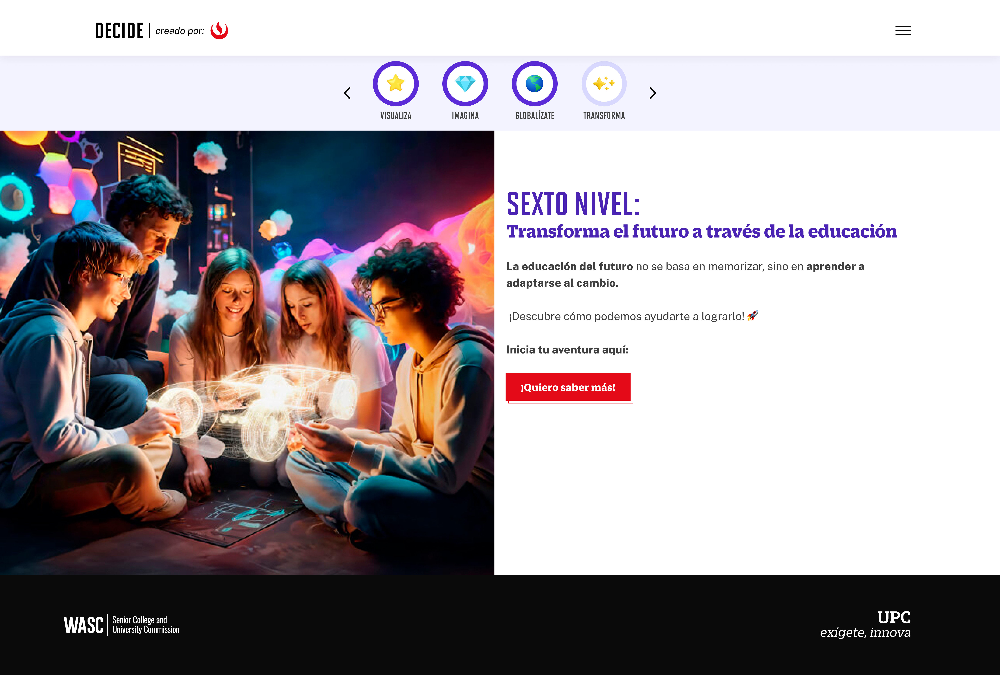

**Data Layer (Payload):**
```yaml
{
  "event"              : "ui_interaction",                           
  "ui_location"        : "content_body",                             
  "ui_element"         : "button",                                   
  "ui_action"          : "click",                                    
  "ui_label"           : "quiero_saber_mas",             # Identificador único o texto del elemento. (En este caso es "Quiero saber más").
  "ui_hierarchy"       : "home > transforma",            # Identificador semántico de la sección donde se ubica. (En este caso es transforma)
  "path_location"      : "/transforma",                  # Path de donde se mide el evento.
}
```

### Evento: `transforma_video`
- **Payload:** [03-niveles-chatbot/fin.yaml](./03-niveles-chatbot/video.yaml)
- **Descripción:** Es necesario medir el Play de Video de transforma.


**Data Layer (Payload):**
```yaml
{
  "event"              : "ui_interaction",                   
  "ui_location"        : "content_body",                     
  "ui_element"         : "video_player",                           
  "ui_action"          : "play",                            
  "ui_label"           : "video_transforma",                   # Identificador único o texto del elemento. (En este caso es "Video transforma").
  "ui_hierarchy"       : "home > transforma > video",          # Identificador semántico de la sección donde se ubica. (En este caso es transforma > video)
  "path_location"      : "/transforma/video",                  # Path de donde se mide el evento.
}
```

### Evento: `transforma_vamospormas`
- **Payload:** [03-niveles-chatbot/fin.yaml](./03-niveles-chatbot/fin.yaml)
- **Descripción:** Clic al botón "Vamos por más", Nivel Transforma


**Data Layer (Payload):**
```yaml
{
  "event"              : "ui_interaction",                   
  "ui_location"        : "content_body",                     
  "ui_element"         : "button",                           
  "ui_action"          : "click",                            
  "ui_label"           : "vamos_por_mas",                           # Identificador único o texto del elemento. (En este caso es "Vamos por más").
  "ui_hierarchy"       : "home > transforma",                       # Identificador semántico de la sección donde se ubica. (En este caso es transforma)
  "path_location"      : "/transforma/ganaste-proposito",           # Path de donde se mide el evento.
}
```

### Evento: `transforma_descargarGuia`
- **Payload:** [03-niveles-chatbot/descargar.yaml](./03-niveles-chatbot/descargar.yaml)
- **Descripción:** Clic al botón de "Descargar Guia" al Nivel de Transforma.


**Data Layer (Payload):**
```yaml
{
  "event"              : "ui_interaction",                           
  "ui_location"        : "modal_window",                             
  "ui_element"         : "button",                                   
  "ui_action"          : "submit",                                   
  "ui_label"           : "descargar_por_wp",                         # Identificador único o texto del elemento, en este caso es "Enviar por WhatsApp".
  "ui_hierarchy"       : "home > transforma",                        # Identificador semántico de la sección donde se ubica. (En este caso es home > transforma)
  "path_location"      : "/transforma/ganaste-proposito",            # Path de donde se mide el evento.
}
```

---

## ⭐ 09 - CSAT

### Evento: `enviar`
- **Payload:** [04-csat/button_csat_enviar.yaml](./04-csat/button_csat_enviar.yaml)
- **Descripción:** Se envían las marcaciones de CSAT de Autoconocimiento.


**Data Layer (Payload):**
```yaml
{
  "event"           : "ui_interaction",                              
  "ui_location"     : "screen_view",                                 
  "ui_element"      : "button",                                      
  "ui_action"       : "submit",                                      
  "ui_label"        : "enviar_csat",                                 # Identificador único o texto del elemento. (En este caso es "Enviar CSAT").
  "ui_hierarchy"    : "home > autoconocimiento > csat",              # Identificador semántico de la sección donde se ubica. (En este caso es home > autoconocimiento > csat)
  "path_location"   : "/conocete/test-vocacional/csta" ,             # Path de donde se mide el evento.
  "csat_value"      : "{{valor de csat}}" ,                          # Valor de las estrellas (1-5).
  "data_collected"  : "{{data_recopilada}}",                         # Mensaje del CSAT.
}
```

### Evento: `explora_enviar_csat`
- **Payload:** [04-csat/button_csat_enviar.yaml](./04-csat/button_csat_enviar.yaml)
- **Descripción:** Se envían las marcaciones de CSAT de Explora.


**Data Layer (Payload):**
```yaml
{
  "event"           : "ui_interaction",                              
  "ui_location"     : "screen_view",                                 
  "ui_element"      : "button",                                      
  "ui_action"       : "submit",                                      
  "ui_label"        : "enviar_csat",                      # Identificador único o texto del elemento. (En este caso es "Enviar CSAT").
  "ui_hierarchy"    : "home > explora > csat",            # Identificador semántico de la sección donde se ubica. (En este caso es home > explora > csat)
  "path_location"   : "/explora/csta" ,                   # Path de donde se mide el evento.
  "csat_value"      : "{{valor de csat}}" ,               # Valor de las estrellas (1-5).
  "data_collected"  : "{{data_recopilada}}",              # Mensaje del CSAT.
}
```

### Evento: `visualiza_enviar_csat`
- **Payload:** [04-csat/button_csat_enviar.yaml](./04-csat/button_csat_enviar.yaml)
- **Descripción:** Se envían las marcaciones de CSAT de Visualiza.


**Data Layer (Payload):**
```yaml
{
  "event"           : "ui_interaction",                              
  "ui_location"     : "screen_view",                                 
  "ui_element"      : "button",                                      
  "ui_action"       : "submit",                                      
  "ui_label"        : "enviar_csat",                      # Identificador único o texto del elemento. (En este caso es "Enviar CSAT").
  "ui_hierarchy"    : "home > visualiza > csat",          # Identificador semántico de la sección donde se ubica. (En este caso es home > visualiza > csat)
  "path_location"   : "/visualiza/csta" ,                 # Path de donde se mide el evento.
  "csat_value"      : "{{valor de csat}}" ,               # Valor de las estrellas (1-5).
  "data_collected"  : "{{data_recopilada}}",              # Mensaje del CSAT.
}
```

### Evento: `imagina_enviar_csat`
- **Payload:** [04-csat/button_csat_enviar.yaml](./04-csat/button_csat_enviar.yaml)
- **Descripción:** Se envían las marcaciones de CSAT de Imagina.


**Data Layer (Payload):**
```yaml
{
  "event"           : "ui_interaction",                              
  "ui_location"     : "screen_view",                                 
  "ui_element"      : "button",                                      
  "ui_action"       : "submit",                                      
  "ui_label"        : "enviar_csat",                      # Identificador único o texto del elemento. (En este caso es "Enviar CSAT").
  "ui_hierarchy"    : "home > imagina > csat",            # Identificador semántico de la sección donde se ubica. (En este caso es home > imagina > csat)
  "path_location"   : "/imagina/csta" ,                   # Path de donde se mide el evento.
  "csat_value"      : "{{valor de csat}}" ,               # Valor de las estrellas (1-5).
  "data_collected"  : "{{data_recopilada}}",              # Mensaje del CSAT.
}
```

### Evento: `globalizate_enviar_csat`
- **Payload:** [04-csat/button_csat_enviar.yaml](./04-csat/button_csat_enviar.yaml)
- **Descripción:** Se envían las marcaciones de CSAT de Globalizate.


**Data Layer (Payload):**
```yaml
{
  "event"           : "ui_interaction",                              
  "ui_location"     : "screen_view",                                 
  "ui_element"      : "button",                                      
  "ui_action"       : "submit",                                      
  "ui_label"        : "enviar_csat",                      # Identificador único o texto del elemento. (En este caso es "Enviar CSAT").
  "ui_hierarchy"    : "home > globalizate > csat",        # Identificador semántico de la sección donde se ubica. (En este caso es home > globalizate > csat)
  "path_location"   : "/globalizate/csta" ,               # Path de donde se mide el evento.
  "csat_value"      : "{{valor de csat}}" ,               # Valor de las estrellas (1-5).
  "data_collected"  : "{{data_recopilada}}",              # Mensaje del CSAT.
}
```

### Evento: `transforma_enviarCsat`
- **Payload:** [04-csat/button_csat_enviar.yaml](./04-csat/button_csat_enviar.yaml)
- **Descripción:** Se envían las marcaciones de CSAT de Transforma.


**Data Layer (Payload):**
```yaml
{
  "event"           : "ui_interaction",                              
  "ui_location"     : "screen_view",                                 
  "ui_element"      : "button",                                      
  "ui_action"       : "submit",                                      
  "ui_label"        : "enviar_csat",                      # Identificador único o texto del elemento. (En este caso es "Enviar CSAT").
  "ui_hierarchy"    : "home > transforma > csat",         # Identificador semántico de la sección donde se ubica. (En este caso es home > transforma > csat)
  "path_location"   : "/transforma/csta" ,                # Path de donde se mide el evento.
  "csat_value"      : "{{valor de csat}}" ,               # Valor de las estrellas (1-5).
  "data_collected"  : "{{data_recopilada}}",              # Mensaje del CSAT.
}
```


### Evento: `explora_enviar_csat_error`
- **Payload:** [04-csat/button_csat_enviar.yaml](./04-csat/button_csat_enviar.yaml)
- **Descripción:** Se envían las marcaciones de CSAT de Error en los CSAT.


**Data Layer (Payload):**
```yaml
{
  "event"           : "ui_interaction",                              
  "ui_location"     : "screen_view",                                
  "ui_element"      : "button",                                      
  "ui_action"       : "submit",                                      
  "ui_label"        : "error_csat",                                 
  "ui_hierarchy"    : "{{Sección donde se da el error}}",            # Identificador semántico de la sección donde se ubica. (En este caso es home > Nivel2 , home > Nivel3, home > Nivel4)
  "path_location"   : "{{path_actual_del_evento}}" ,                 # Path de donde se mide el evento.
  "csat_value"      : "{{valor de csat}}" ,                          # Valor de las estrellas (1-5).
  "data_collected"  : "{{data_recopilada}}",                         # Mensaje del CSAT.
}
```
---

## 😊 10 - Emociones

### Evento: `emociones_continuar`
- **Payload:** [05-emociones/enviar.yaml](./05-emociones/enviar.yaml)
- **Descripción:** Este es el clic al botón de "Continuar" de Emociones.


**Data Layer (Payload):**
```yaml
{
  "event"           : "ui_interaction",                              
  "ui_location"     : "screen_view",                                 
  "ui_element"      : "button",                                      
  "ui_action"       : "submit",                                      
  "ui_label"        : "enviar_emociones",                            # Identificador único o texto del elemento. (En este caso es "Enviar Emociones").
  "ui_hierarchy"    : "home > emociones",                            # Identificador semántico de la sección donde se ubica. (En este caso es home > emociones)
  "path_location"   : "/medidor-de-emociones" ,                      # Path de donde se mide el evento.
  "data_collected"  : "{{data_recopilada}}",                         # Mensaje que sale en el formulario, como estoy interesado, no estoy interesado, etc.
}
```
