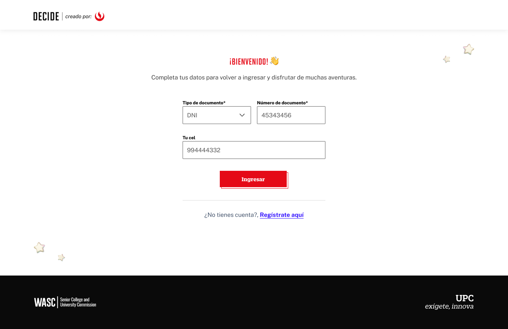

# Guía Visual: Login (00-registro)
**Payload General:** [../00-registro/login.yaml](../00-registro/login.yaml)

---
## Instancia: ingresar
- **Descripción:** Este evento cuando hacer login, cuando ya tienes una cuenta en la plataforma.



**Data Layer (Payload):**
```yaml
{
  "event"          : "ui_interaction",                               
  "ui_location"    : "screen_view",                                  
  "ui_element"     : "button",                                      
  "ui_action"      : "submit",                                       
  "ui_label"       : "login",                                        
  "ui_hierarchy"   : "home > login",                              
  "path_location"  : "/iniciar-sesion",                   # Path de donde se mide el evento.
  "user_code"      : "{{id_usuario}}"                     # Código de usuario (alumno o prospecto, código de HubSpot)
}
```

