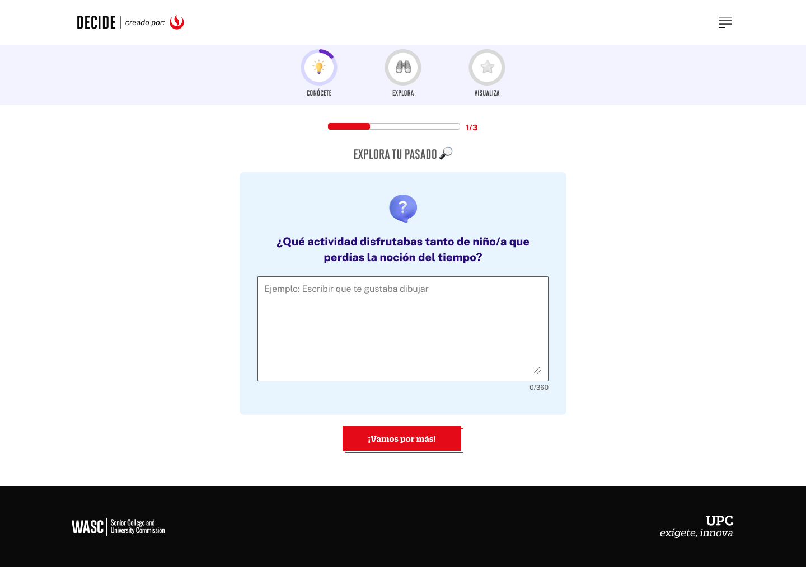

# Guía Visual: Preguntas (01-nivel1)
**Payload General:** [../01-nivel1/preguntas.yaml](../01-nivel1/preguntas.yaml)

---
## Instancia: siguiente
- **Descripción:** Este evento mide cuando se envian las respuestas de las Preguntas de Autoconocimiento.



**Data Layer (Payload):**
```yaml
{
  "event"              : "ui_interaction",                           
  "ui_location"        : "content_body",                             
  "ui_element"         : "button",                                  
  "ui_action"          : "submit",                                   
  "ui_label"           : "{{nombre_del_boton}}",                 # Identificador único o texto del elemento, depende de la pregunta. Para el caso de la imagen de ejemplo es "Vamos por más".
  "ui_hierarchy"       : "home > nivel1 > Pregunta[1-3]",        # Identificador semántico de la sección donde se ubica. (En este caso es Nivel 1, acompañado por el número de pregunta que se responde).
  "path_location"      : "/conocete/encuesta?pregunta=[1-3]",    # Path de donde se mide el evento. En este caso se mide por el número de preguntas, para este caso son 3 preguntas.
  "data_collected"     : "{{data_recopilada}}",                  # Se guarda lo que llena el usuario.
}
```

