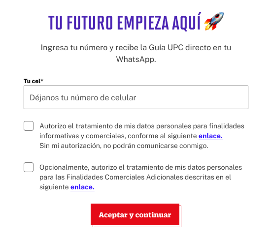

# Guía Visual: Enviar Por Whatsapp (02-test-autoconocimiento)
**Payload General:** [../02-test-autoconocimiento/enviar_por_whatsapp.yaml](../02-test-autoconocimiento/enviar_por_whatsapp.yaml)

---
## Instancia: enviar_resultados_whatsapp
- **Descripción:** Clic al botón "Enviar Resultados por WhatsApp" en el Modal de descarga, en el Test de Autoconocimiento.



**Data Layer (Payload):**
```yaml
{
  "event"              : "ui_interaction",                          
  "ui_location"        : "modal_window",                             
  "ui_element"         : "button",                                   
  "ui_action"          : "submit",                                   
  "ui_label"           : "enviar_por_whatssapp",                                 # Identificador único o texto del elemento. (En este caso es "Enviar por WhatsApp").
  "ui_hierarchy"       : "home > autoconocimiento",                              # Identificador semántico de la sección donde se ubica. (En este caso es autoconocimiento)
  "path_location"      : "/conocete/test-vocacional/descargar-resultados",       # Path de donde se mide el evento.
}
```

