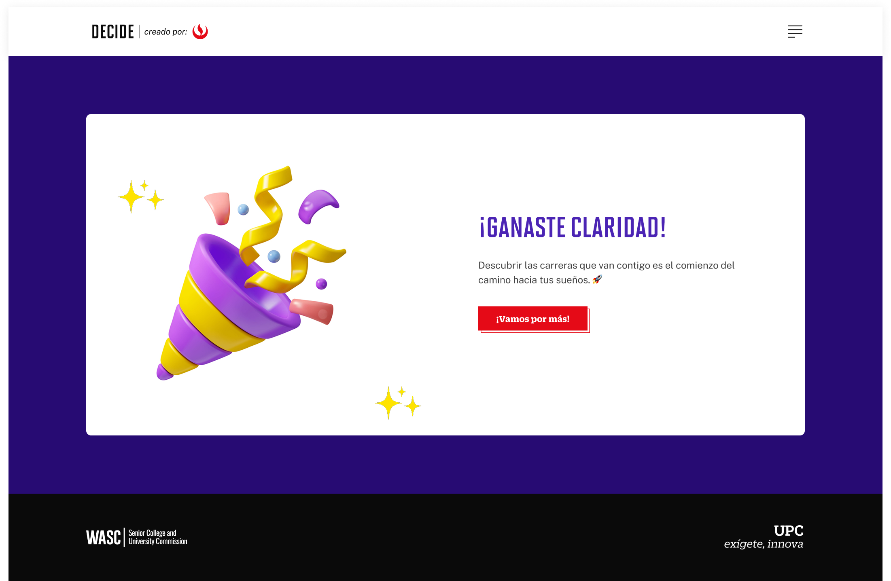

# Guía Visual: Fin (02-test-autoconocimiento)
**Payload General:** [../02-test-autoconocimiento/fin.yaml](../02-test-autoconocimiento/fin.yaml)

---
## Instancia: finaliza_nivel
- **Descripción:** Este evento mide cuando se termina el Test de Autoconocimiento.



**Data Layer (Payload):**
```yaml
{
  "event"              : "ui_interaction",                           
  "ui_location"        : "content_body",                             
  "ui_element"         : "button",                                   
  "ui_action"          : "click",                                    
  "ui_label"           : "exito",                                    # Identificador único o texto del elemento. (En este caso es "Éxito").
  "ui_hierarchy"       : "home > autoconocimiento",                  # Identificador semántico de la sección donde se ubica. (En este caso es autoconocimiento)
  "path_location"      : "/conocete/test-vocacional/exito",          # Path de donde se mide el evento.
}
```

