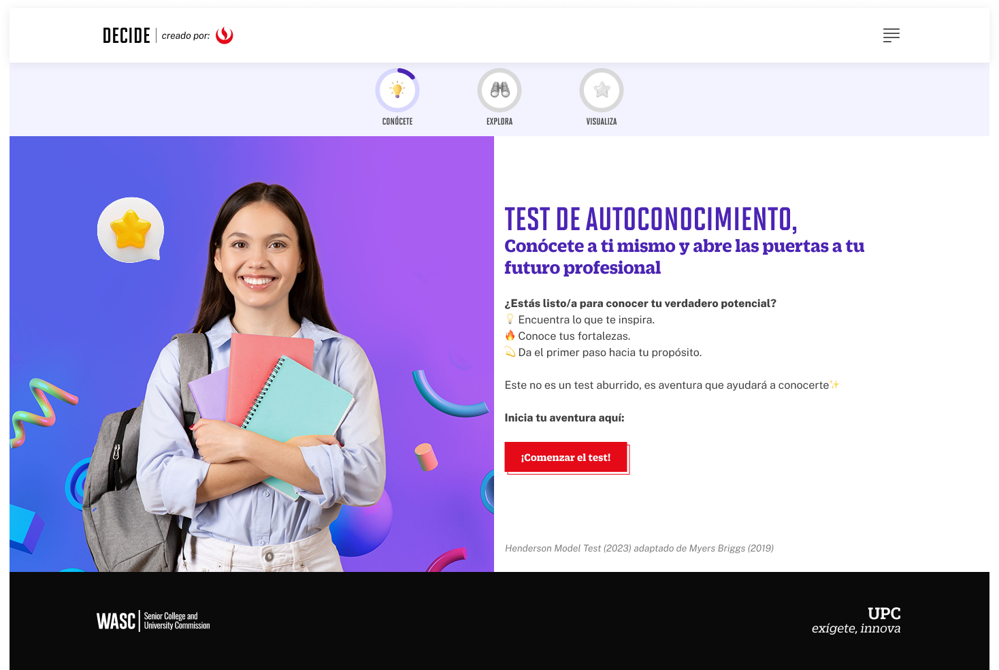

# Guía Visual: Inicio (02-test-autoconocimiento)
**Payload General:** [../02-test-autoconocimiento/inicio.yaml](../02-test-autoconocimiento/inicio.yaml)

---
## Instancia: comenzar_el_test
- **Descripción:** Clic al botón "Comenzar el Test", en el Test de Autoconocimiento.



**Data Layer (Payload):**
```yaml
{
  "event"              : "ui_interaction",                           
  "ui_location"        : "content_body",                             
  "ui_element"         : "button",                                   
  "ui_action"          : "click",                                    
  "ui_label"           : "comenzar_el_test",                # Identificador único o texto del elemento. (En este caso es "Comenzar el Test").
  "ui_hierarchy"       : "home > autoconocimiento",         # Identificador semántico de la sección donde se ubica. (En este caso es autoconocimiento).
  "path_location"      : "/conocete/test-vocacional"        # Path de donde se mide el evento.
}
```

