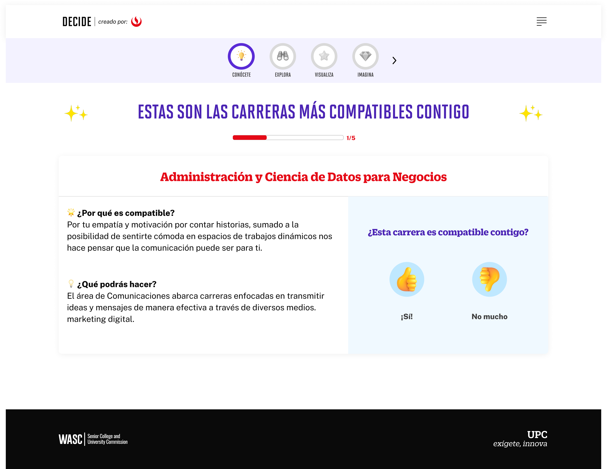

# Guía Visual: Valoración Carreras (02-test-autoconocimiento)
**Payload General:** [../02-test-autoconocimiento/valoracion_carreras.yaml](../02-test-autoconocimiento/valoracion_carreras.yaml)

---
## Instancia: si
- **Descripción:** Clic al botón "¡Sí!" para aceptar la carrera que la IA propone.



**Data Layer (Payload):**
```yaml
{
  "event"              : "ui_interaction",                          
  "ui_location"        : "content_body",                             
  "ui_element"         : "button",                                   
  "ui_action"          : "click",                                    
  "ui_label"           : "si",                                             # Texto del botón "¡Sí!" normalizado.
  "ui_hierarchy"       : "home > autoconocimiento > valoracion_carreras",  # Identificador semántico de la sección.
  "path_location"      : "/conocete/test-vocacional/carreras",             # Path de donde se mide el evento.
  "data_collected"     : "{{nro_orden_y_carrera}}"                         # Orden y la carrera que es aceptada (ej. "nro_orden: 1 | carrera: Odontología").
}
```

---
## Instancia: no_mucho
- **Descripción:** Clic al botón "No mucho" para rechazar la carrera que la IA propone.


**Data Layer (Payload):**
```yaml
{
  "event"              : "ui_interaction",                          
  "ui_location"        : "content_body",                             
  "ui_element"         : "button",                                   
  "ui_action"          : "click",                                    
  "ui_label"           : "no_mucho",                                       # Texto del botón "No mucho" normalizado.
  "ui_hierarchy"       : "home > autoconocimiento > valoracion_carreras",  # Identificador semántico de la sección.
  "path_location"      : "/conocete/test-vocacional/carreras",             # Path de donde se mide el evento.
  "data_collected"     : "{{nro_orden_y_carrera}}"                         # Orden y la carrera que es rechazada (ej. "nro_orden: 1 | carrera: Odontología").
}
```
