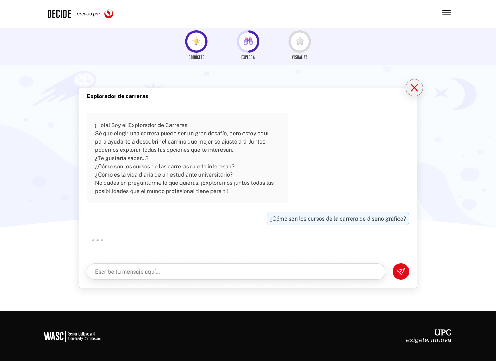
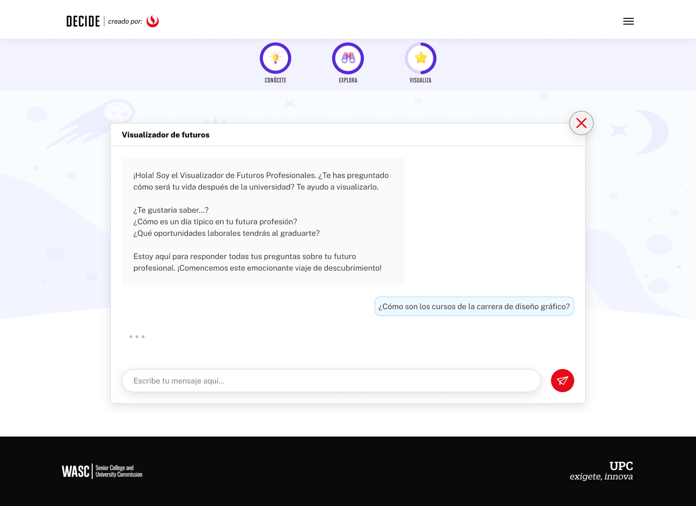
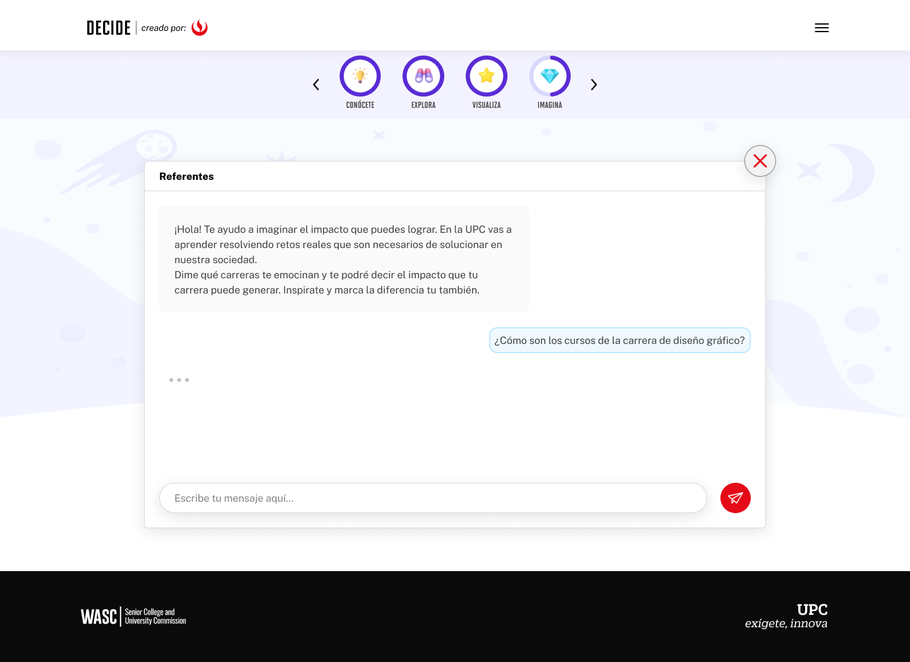
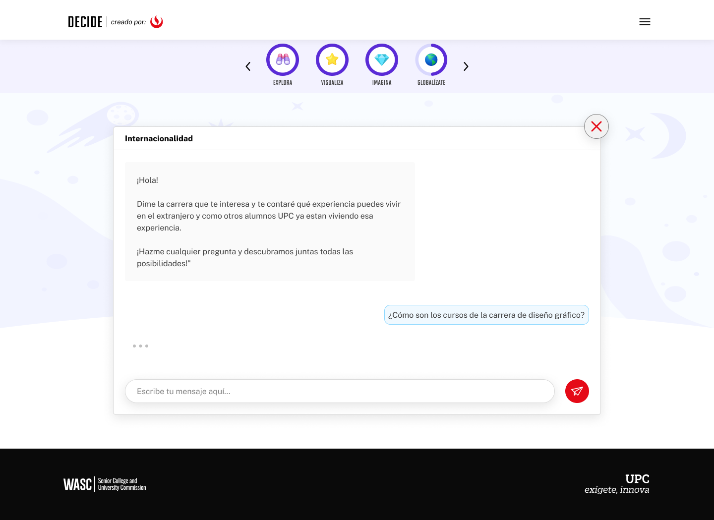

# Guía Visual: Chatbot (03-niveles-chatbot)
**Payload General:** [../03-niveles-chatbot/chatbot.yaml](../03-niveles-chatbot/chatbot.yaml)

---
## Instancia: explora_chatbot
- **Descripción:** Este evento mide las interacciones con la IA de Explora.



**Data Layer (Payload):**
```yaml
{
  "event"              : "ui_interaction",                           
  "ui_location"        : "chat_window",                              
  "ui_element"         : "button",                                   
  "ui_action"          : "click",                                   
  "ui_label"           : "ia_chatbot",                               
  "ui_hierarchy"       : "home > explora > chatbot",                 # Identificador semántico de la sección donde se ubica. (En este caso es explora > chatbot)
  "path_location"      : "/explora/chatbot",                         # Path de donde se mide el evento.
  "data_collected"     : "{{pregunta_y_respuesta}}"                  # Mensaje del Chatbot y pregunta del estudiante.
}
```

---
## Instancia: visualiza_chatbot
- **Descripción:** Este evento mide las interacciones con la IA de Visualiza.



**Data Layer (Payload):**
```yaml
{
  "event"              : "ui_interaction",                           
  "ui_location"        : "chat_window",                              
  "ui_element"         : "button",                                   
  "ui_action"          : "click",                                   
  "ui_label"           : "ia_chatbot",                               
  "ui_hierarchy"       : "home > visualiza > chatbot",               # Identificador semántico de la sección donde se ubica. (En este caso es visualiza > chatbot)
  "path_location"      : "/visualiza/chatbot",                       # Path de donde se mide el evento.
  "data_collected"     : "{{pregunta_y_respuesta}}"                  # Mensaje del Chatbot y pregunta del estudiante.
}
```

---
## Instancia: imagina_chatbot
- **Descripción:** Este evento mide las interacciones con la IA de Imagina.



**Data Layer (Payload):**
```yaml
{
  "event"              : "ui_interaction",                           
  "ui_location"        : "chat_window",                              
  "ui_element"         : "button",                                   
  "ui_action"          : "click",                                   
  "ui_label"           : "ia_chatbot",                               
  "ui_hierarchy"       : "home > imagina > chatbot",                 # Identificador semántico de la sección donde se ubica. (En este caso es imagina > chatbot)
  "path_location"      : "/imagina/chatbot",                       # Path de donde se mide el evento.
  "data_collected"     : "{{pregunta_y_respuesta}}"                  # Mensaje del Chatbot y pregunta del estudiante.
}
```

---
## Instancia: globalizate_chatbot
- **Descripción:** Este evento mide las interacciones con la IA de Globalizate.



**Data Layer (Payload):**
```yaml
{
  "event"              : "ui_interaction",                           
  "ui_location"        : "chat_window",                              
  "ui_element"         : "button",                                   
  "ui_action"          : "click",                                   
  "ui_label"           : "ia_chatbot",                               
  "ui_hierarchy"       : "home > globalizate > chatbot",             # Identificador semántico de la sección donde se ubica. (En este caso es globalizate > chatbot)
  "path_location"      : "/globalizate/chatbot",                     # Path de donde se mide el evento.
  "data_collected"     : "{{pregunta_y_respuesta}}"                  # Mensaje del Chatbot y pregunta del estudiante.
}
```
