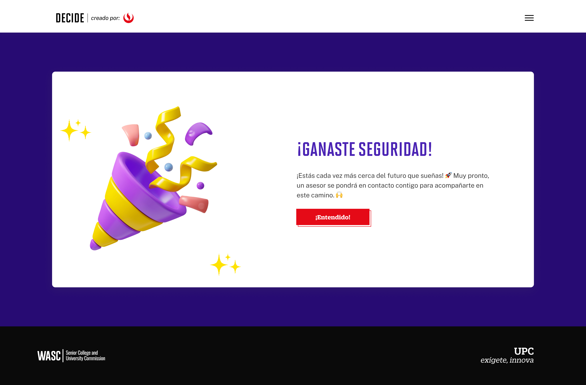
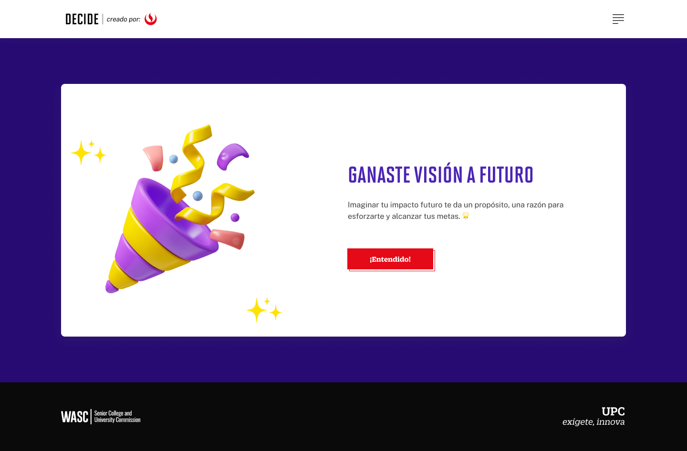
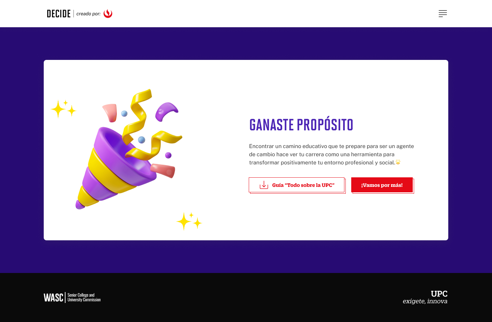

# Guía Visual: Fin (03-niveles-chatbot)
**Payload General:** [../03-niveles-chatbot/fin.yaml](../03-niveles-chatbot/fin.yaml)

---
## Instancia: explora_fin
- **Descripción:** Clic al botón "Fin", Nivel Explora



**Data Layer (Payload):**
```yaml
{
  "event"              : "ui_interaction",                   
  "ui_location"        : "content_body",                     
  "ui_element"         : "button",                           
  "ui_action"          : "click",                            
  "ui_label"           : "entendido",                        # Identificador único o texto del elemento. (En este caso es "Entendido").
  "ui_hierarchy"       : "home > explora",                   # Identificador semántico de la sección donde se ubica. (En este caso es explora)
  "path_location"      : "/explora/ganaste-seguridad",       # Path de donde se mide el evento.
}
```

---
## Instancia: visualiza_entendido
- **Descripción:** Clic al botón "Entendido", de Visualiza



**Data Layer (Payload):**
```yaml
{
  "event"              : "ui_interaction",                   
  "ui_location"        : "content_body",                     
  "ui_element"         : "button",                           
  "ui_action"          : "click",                            
  "ui_label"           : "entendido",                              # Identificador único o texto del elemento. (En este caso es "Entendido").
  "ui_hierarchy"       : "home > visualiza",                       # Identificador semántico de la sección donde se ubica. (En este caso es visualiza)
  "path_location"      : "/visualiza/ganaste-vision-a-futuro",     # Path de donde se mide el evento.
}
```

---
## Instancia: imagina_vamospormas
- **Descripción:** Clic al botón "Vamos por más", Nivel Imagina


**Data Layer (Payload):**
```yaml
{
  "event"              : "ui_interaction",                   
  "ui_location"        : "content_body",                     
  "ui_element"         : "button",                           
  "ui_action"          : "click",                            
  "ui_label"           : "vamos_por_mas",                       # Identificador único o texto del elemento. (En este caso es "Vamos por más").
  "ui_hierarchy"       : "home > imagina",                      # Identificador semántico de la sección donde se ubica. (En este caso es imagina)
  "path_location"      : "/imagina/ganaste-inspiracion",        # Path de donde se mide el evento.
}
```

---
## Instancia: globalizate_vamospormas
- **Descripción:** Clic al botón "Vamos por más", Nivel Globalizate


**Data Layer (Payload):**
```yaml
{
  "event"              : "ui_interaction",                   
  "ui_location"        : "content_body",                     
  "ui_element"         : "button",                           
  "ui_action"          : "click",                            
  "ui_label"           : "vamos_por_mas",                           # Identificador único o texto del elemento. (En este caso es "Vamos por más").
  "ui_hierarchy"       : "home > globalizate",                      # Identificador semántico de la sección donde se ubica. (En este caso es globalizate)
  "path_location"      : "/globalizate/ganaste-oportunidades",      # Path de donde se mide el evento.
}
```

---
## Instancia: transforma_vamospormas
- **Descripción:** Clic al botón "Vamos por más", Nivel Transforma



**Data Layer (Payload):**
```yaml
{
  "event"              : "ui_interaction",                   
  "ui_location"        : "content_body",                     
  "ui_element"         : "button",                           
  "ui_action"          : "click",                            
  "ui_label"           : "vamos_por_mas",                           # Identificador único o texto del elemento. (En este caso es "Vamos por más").
  "ui_hierarchy"       : "home > transforma",                       # Identificador semántico de la sección donde se ubica. (En este caso es transforma)
  "path_location"      : "/transforma/ganaste-proposito",           # Path de donde se mide el evento.
}
```

