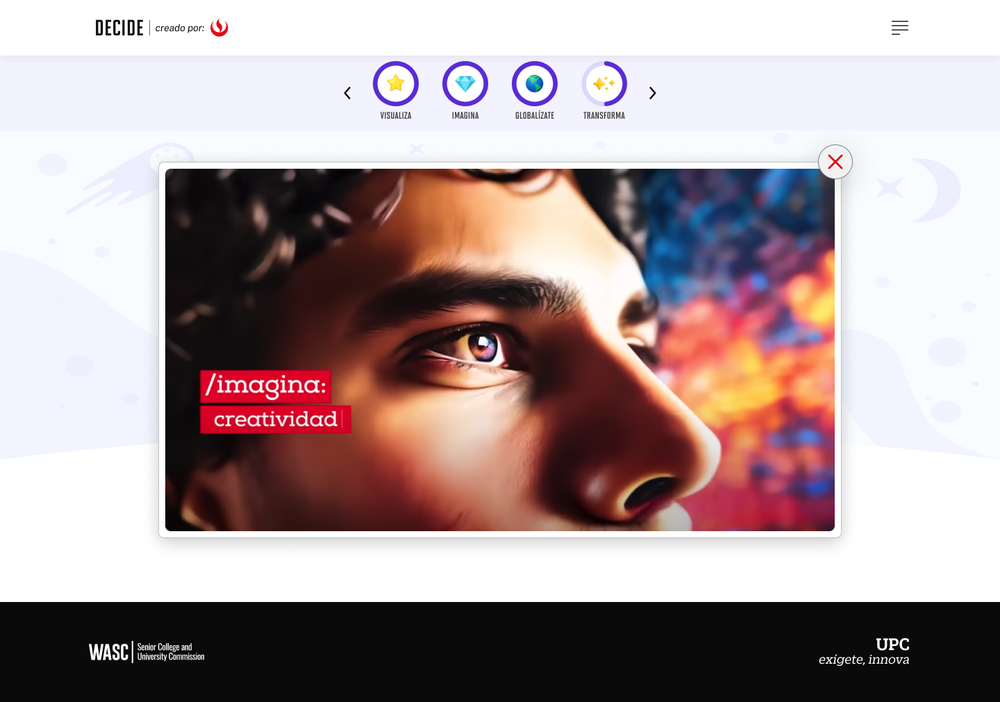

# Guía Visual: Video (03-niveles-chatbot)
**Payload General:** [../03-niveles-chatbot/video.yaml](../03-niveles-chatbot/video.yaml)

---
## Instancia: transforma_video
- **Descripción:** Es necesario medir el Play de Video de transforma.



**Data Layer (Payload):**
```yaml
{
  "event"              : "ui_interaction",                   
  "ui_location"        : "content_body",                     
  "ui_element"         : "video_player",                           
  "ui_action"          : "play",                            
  "ui_label"           : "video_transforma",                   # Identificador único o texto del elemento. (En este caso es "Video transforma").
  "ui_hierarchy"       : "home > transforma > video",          # Identificador semántico de la sección donde se ubica. (En este caso es transforma > video)
  "path_location"      : "/transforma/video",                  # Path de donde se mide el evento.
}
```

