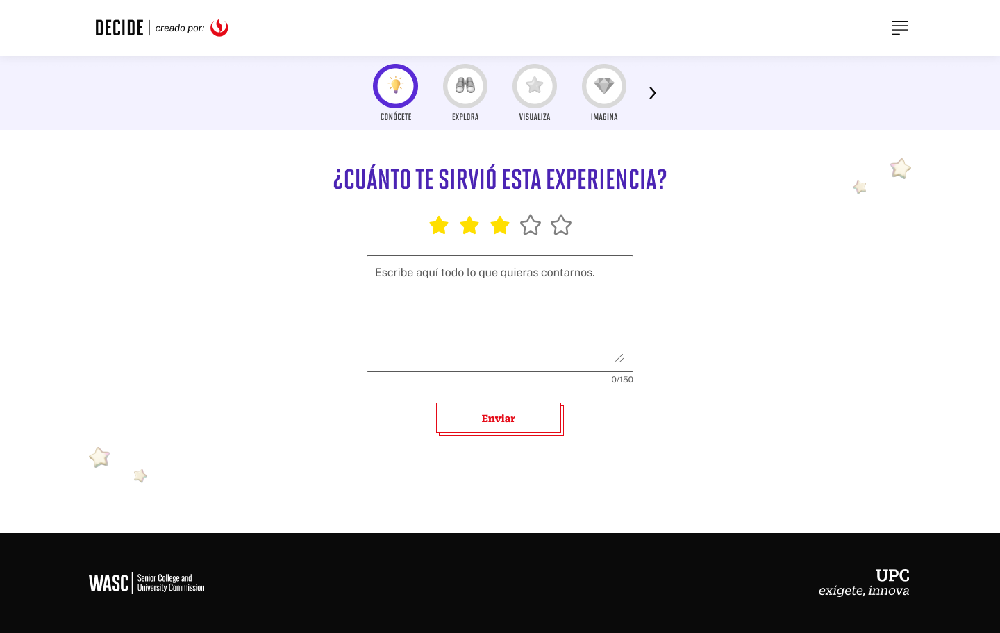
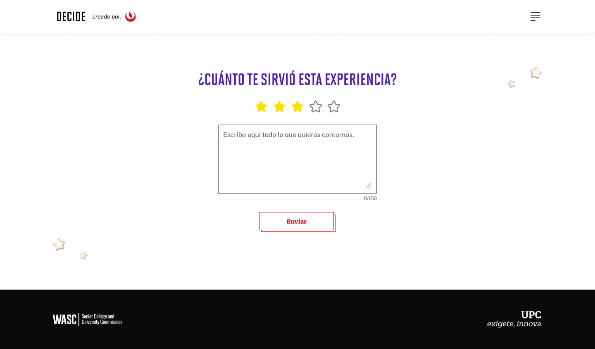
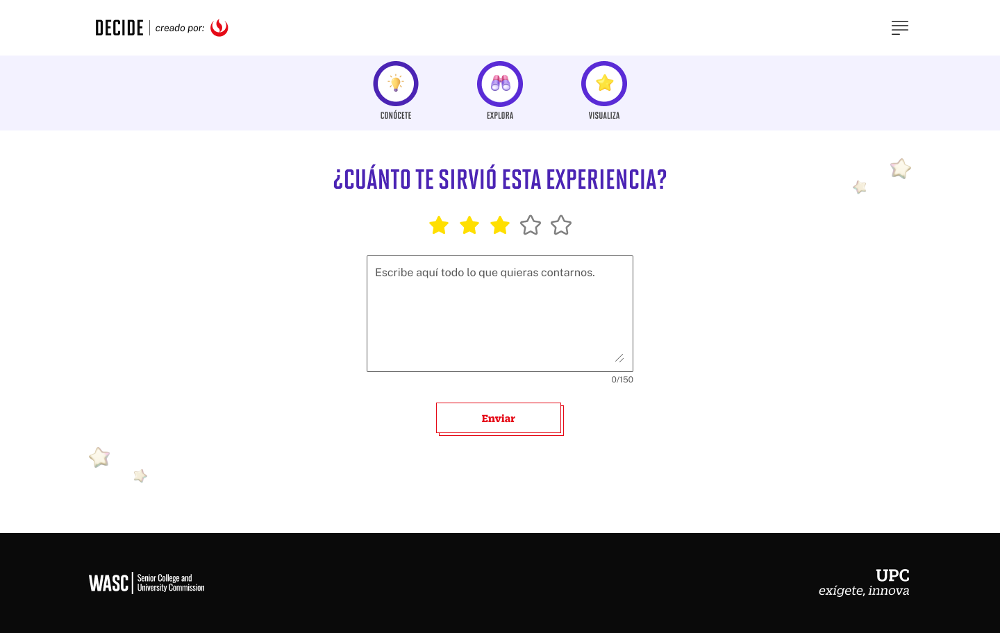
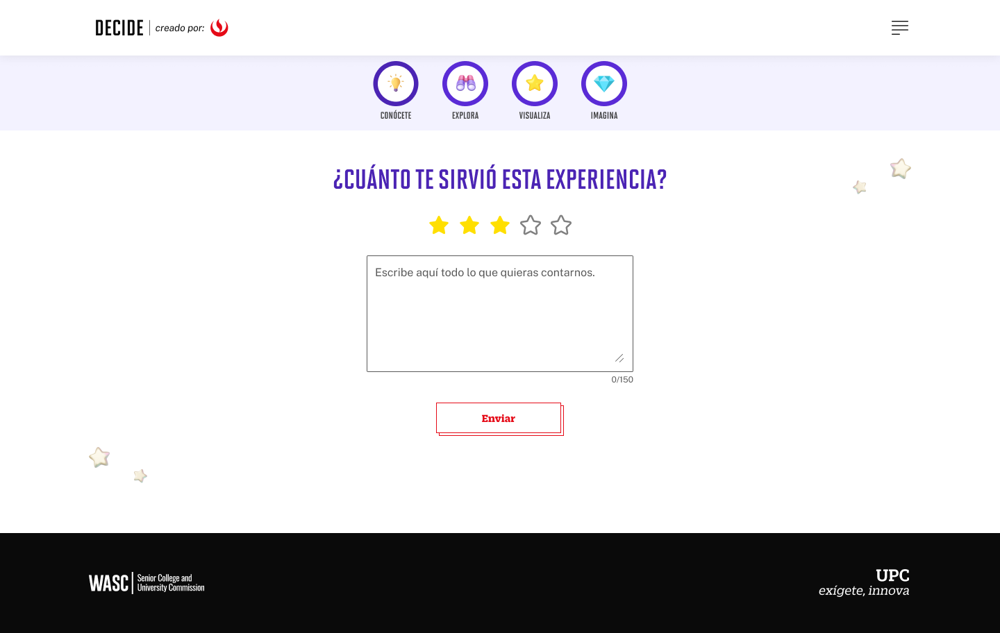
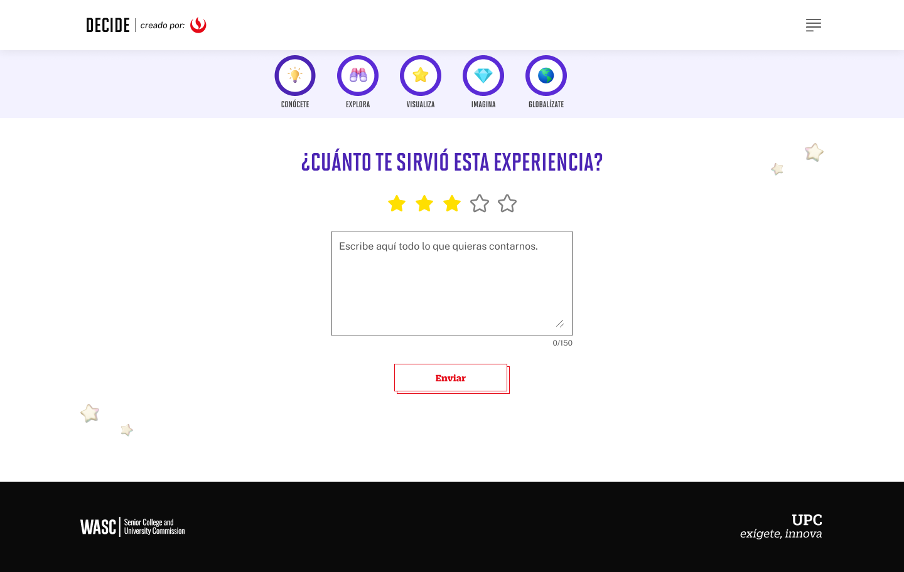
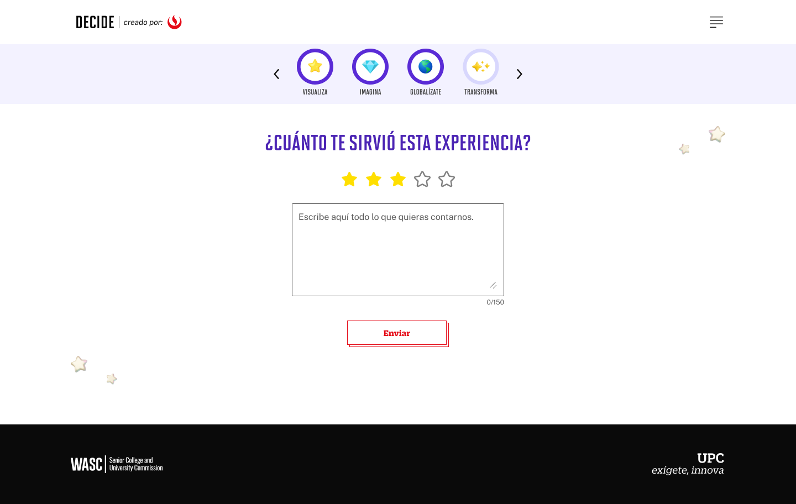

# Guía Visual: Button Csat Enviar (04-csat)
**Payload General:** [../04-csat/button_csat_enviar.yaml](../04-csat/button_csat_enviar.yaml)

---
## Instancia: enviar
- **Descripción:** Se envían las marcaciones de CSAT de Autoconocimiento.



**Data Layer (Payload):**
```yaml
{
  "event"           : "ui_interaction",                              
  "ui_location"     : "screen_view",                                 
  "ui_element"      : "button",                                      
  "ui_action"       : "submit",                                      
  "ui_label"        : "enviar_csat",                                 # Identificador único o texto del elemento. (En este caso es "Enviar CSAT").
  "ui_hierarchy"    : "home > autoconocimiento > csat",              # Identificador semántico de la sección donde se ubica. (En este caso es home > autoconocimiento > csat)
  "path_location"   : "/conocete/test-vocacional/csta" ,             # Path de donde se mide el evento.
  "csat_value"      : "{{valor de csat}}" ,                          # Valor de las estrellas (1-5).
  "data_collected"  : "{{data_recopilada}}",                         # Mensaje del CSAT.
}
```

---
## Instancia: explora_enviar_csat
- **Descripción:** Se envían las marcaciones de CSAT de Explora.



**Data Layer (Payload):**
```yaml
{
  "event"           : "ui_interaction",                              
  "ui_location"     : "screen_view",                                 
  "ui_element"      : "button",                                      
  "ui_action"       : "submit",                                      
  "ui_label"        : "enviar_csat",                      # Identificador único o texto del elemento. (En este caso es "Enviar CSAT").
  "ui_hierarchy"    : "home > explora > csat",            # Identificador semántico de la sección donde se ubica. (En este caso es home > explora > csat)
  "path_location"   : "/explora/csta" ,                   # Path de donde se mide el evento.
  "csat_value"      : "{{valor de csat}}" ,               # Valor de las estrellas (1-5).
  "data_collected"  : "{{data_recopilada}}",              # Mensaje del CSAT.
}
```

---
## Instancia: visualiza_enviar_csat
- **Descripción:** Se envían las marcaciones de CSAT de Visualiza.



**Data Layer (Payload):**
```yaml
{
  "event"           : "ui_interaction",                              
  "ui_location"     : "screen_view",                                 
  "ui_element"      : "button",                                      
  "ui_action"       : "submit",                                      
  "ui_label"        : "enviar_csat",                      # Identificador único o texto del elemento. (En este caso es "Enviar CSAT").
  "ui_hierarchy"    : "home > visualiza > csat",          # Identificador semántico de la sección donde se ubica. (En este caso es home > visualiza > csat)
  "path_location"   : "/visualiza/csta" ,                 # Path de donde se mide el evento.
  "csat_value"      : "{{valor de csat}}" ,               # Valor de las estrellas (1-5).
  "data_collected"  : "{{data_recopilada}}",              # Mensaje del CSAT.
}
```

---
## Instancia: imagina_enviar_csat
- **Descripción:** Se envían las marcaciones de CSAT de Imagina.



**Data Layer (Payload):**
```yaml
{
  "event"           : "ui_interaction",                              
  "ui_location"     : "screen_view",                                 
  "ui_element"      : "button",                                      
  "ui_action"       : "submit",                                      
  "ui_label"        : "enviar_csat",                      # Identificador único o texto del elemento. (En este caso es "Enviar CSAT").
  "ui_hierarchy"    : "home > imagina > csat",            # Identificador semántico de la sección donde se ubica. (En este caso es home > imagina > csat)
  "path_location"   : "/imagina/csta" ,                   # Path de donde se mide el evento.
  "csat_value"      : "{{valor de csat}}" ,               # Valor de las estrellas (1-5).
  "data_collected"  : "{{data_recopilada}}",              # Mensaje del CSAT.
}
```

---
## Instancia: globalizate_enviar_csat
- **Descripción:** Se envían las marcaciones de CSAT de Globalizate.



**Data Layer (Payload):**
```yaml
{
  "event"           : "ui_interaction",                              
  "ui_location"     : "screen_view",                                 
  "ui_element"      : "button",                                      
  "ui_action"       : "submit",                                      
  "ui_label"        : "enviar_csat",                      # Identificador único o texto del elemento. (En este caso es "Enviar CSAT").
  "ui_hierarchy"    : "home > globalizate > csat",        # Identificador semántico de la sección donde se ubica. (En este caso es home > globalizate > csat)
  "path_location"   : "/globalizate/csta" ,               # Path de donde se mide el evento.
  "csat_value"      : "{{valor de csat}}" ,               # Valor de las estrellas (1-5).
  "data_collected"  : "{{data_recopilada}}",              # Mensaje del CSAT.
}
```

---
## Instancia: transforma_enviarCsat
- **Descripción:** Se envían las marcaciones de CSAT de Transforma.



**Data Layer (Payload):**
```yaml
{
  "event"           : "ui_interaction",                              
  "ui_location"     : "screen_view",                                 
  "ui_element"      : "button",                                      
  "ui_action"       : "submit",                                      
  "ui_label"        : "enviar_csat",                      # Identificador único o texto del elemento. (En este caso es "Enviar CSAT").
  "ui_hierarchy"    : "home > transforma > csat",         # Identificador semántico de la sección donde se ubica. (En este caso es home > transforma > csat)
  "path_location"   : "/transforma/csta" ,                # Path de donde se mide el evento.
  "csat_value"      : "{{valor de csat}}" ,               # Valor de las estrellas (1-5).
  "data_collected"  : "{{data_recopilada}}",              # Mensaje del CSAT.
}
```

---
## Instancia: explora_enviar_csat_error
- **Descripción:** Se envían las marcaciones de CSAT de Error en los CSAT.


**Data Layer (Payload):**
```yaml
{
  "event"           : "ui_interaction",                              
  "ui_location"     : "screen_view",                                
  "ui_element"      : "button",                                      
  "ui_action"       : "submit",                                      
  "ui_label"        : "error_csat",                                 
  "ui_hierarchy"    : "{{Sección donde se da el error}}",            # Identificador semántico de la sección donde se ubica. (En este caso es home > Nivel2 , home > Nivel3, home > Nivel4)
  "path_location"   : "{{path_actual_del_evento}}" ,                 # Path de donde se mide el evento.
  "csat_value"      : "{{valor de csat}}" ,                          # Valor de las estrellas (1-5).
  "data_collected"  : "{{data_recopilada}}",                         # Mensaje del CSAT.
}
```

