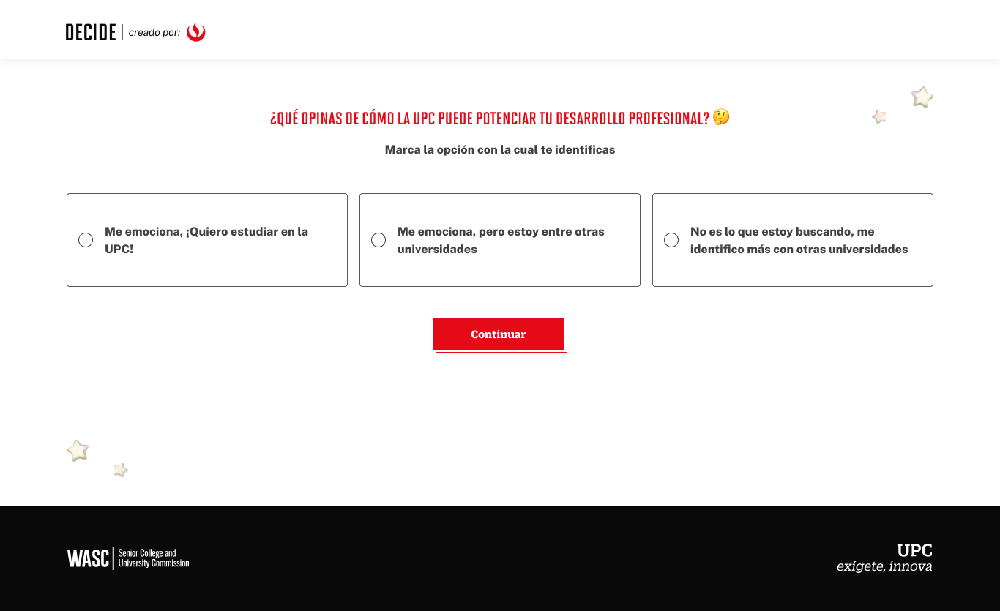

# Guía Visual: Enviar (05-emociones)
**Payload General:** [../05-emociones/enviar.yaml](../05-emociones/enviar.yaml)

---
## Instancia: emociones_continuar
- **Descripción:** Este es el clic al botón de "Continuar" de Emociones.



**Data Layer (Payload):**
```yaml
{
  "event"           : "ui_interaction",                              
  "ui_location"     : "screen_view",                                 
  "ui_element"      : "button",                                      
  "ui_action"       : "submit",                                      
  "ui_label"        : "enviar_emociones",                            # Identificador único o texto del elemento. (En este caso es "Enviar Emociones").
  "ui_hierarchy"    : "home > emociones",                            # Identificador semántico de la sección donde se ubica. (En este caso es home > emociones)
  "path_location"   : "/medidor-de-emociones" ,                      # Path de donde se mide el evento.
  "data_collected"  : "{{data_recopilada}}",                         # Mensaje que sale en el formulario, como estoy interesado, no estoy interesado, etc.
}
```

