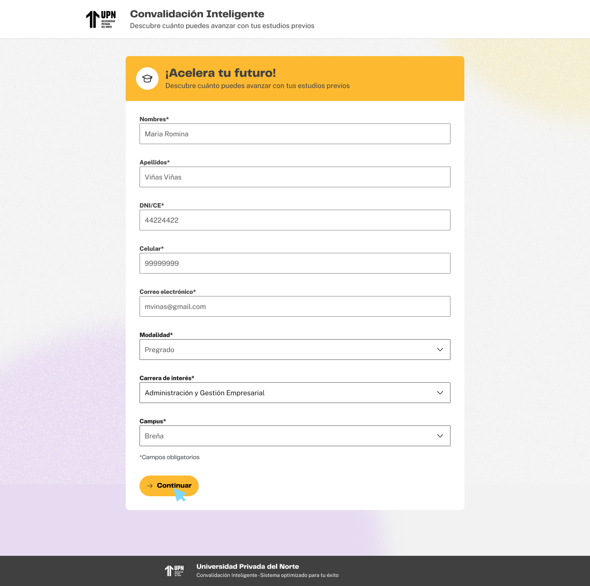

# Guía Visual: paso-inicial (00-Inicio)
**Payload General:** [../00-Inicio/paso-inicial.yaml](../00-Inicio/paso-inicial.yaml)

---
## Instancia: generar_simulacion
- **Descripción:** Cuando el usuario hace clic en el botón "Generar simulación" para iniciar el flujo de convalidación rápida.



**Data Layer (Payload):**
```yaml
{
  "event"            : "ui_interaction",                    # Nombre fijo del evento
  "ui_location"      : "form_container",                    # Dónde está el elemento
  "ui_element"       : "button",                            # Qué es el elemento
  "ui_action"        : "click",                             # Qué hace (open_modal, navigation, etc.)
  "ui_label"         : "empezar_analisis",                  # Identificador único o texto del elemento. (En este caso es "empezar analisis")
  "ui_hierarchy"     : "home",                              # Identificador semántico de la sección donde se úbica. En este caso es home.
  "path_location"    : "/",                                 # Path de donde se mide el evento.
  "data_collected"   : "{{data_recopilada}}",               # Se recomienda guardar los datos de la respuesta del Formulario como: Carrera previa, Carrera Objetivo, Si terminó o no la Carrera.
  "user_code"        : "{{id_usuario}}"                     # Código de usuario (prospecto, código de Hubspot), para identificación de un usuario.
}
```
