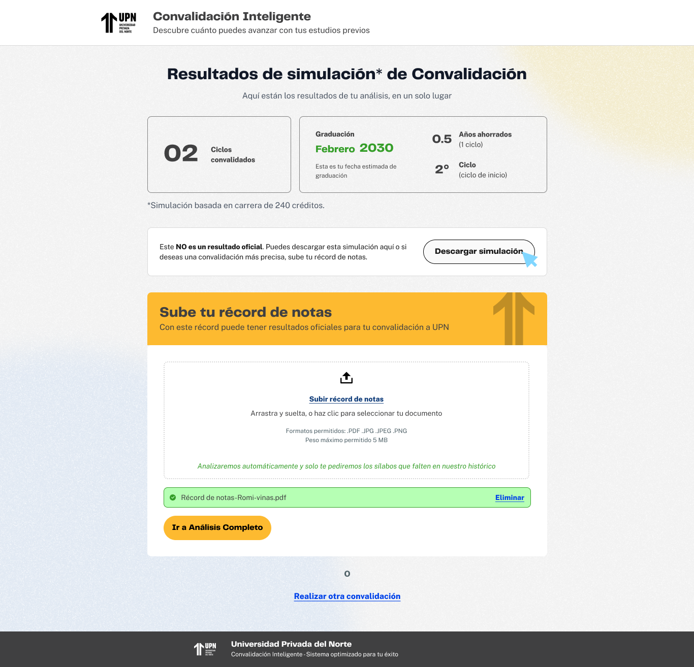

# Guía Visual: descarga-resultado (01-convalidacion)
**Payload General:** [../01-convalidacion/descarga-resultado.yaml](../01-convalidacion/descarga-resultado.yaml)

---
## Instancia: descargar_simulacion
- **Descripción:** Cuando el usuario hace clic en el botón de descarga del resultado de la simulación de convalidación.



**Data Layer (Payload):**
```yaml
{
  "event"            : "ui_interaction",                    # Nombre fijo del evento
  "ui_location"      : "content_body",                      # Dónde está el elemento
  "ui_element"       : "button",                            # Qué es el elemento
  "ui_action"        : "click",                             # Qué hace (open_modal, navigation, etc.)
  "ui_label"         : "descargar_simulacion",              # Identificador único o texto del elemento. (En este caso es "descargar simulación")
  "ui_hierarchy"     : "home > convalidacion",              # Identificador semantico de la seccion donde se ubica. En este caso convalidación.
  "path_location"    : "/convalidacion"                     # Path de donde se mide el evento.
}
```
