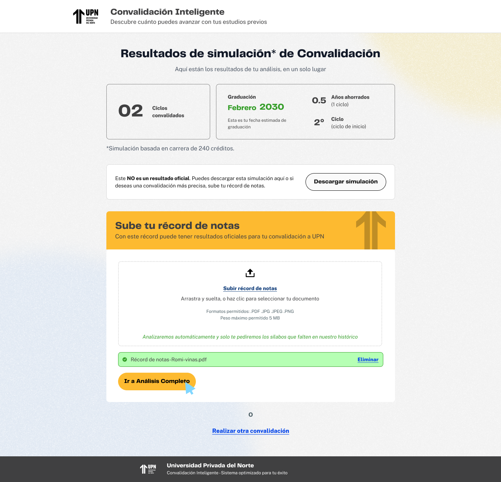

# Guía Visual: empezar-analisis (01-convalidacion)
**Payload General:** [../01-convalidacion/empezar-analisis.yaml](../01-convalidacion/empezar-analisis.yaml)

---
## Instancia: empezar_analisis
- **Descripción:** Cuando el usuario hace clic en el botón para comenzar el análisis de sus notas para la convalidación. *(Nota: La captura asignada corresponde a la pantalla de resultados, pero el botón "Empezar Análisis" se encuentra en el formulario de antecedentes académicos. La pantalla real con el botón "Empezar Análisis" es parcialmente visible en la captura de error en segundo plano).*



**Data Layer (Payload):**
```yaml
{
  "event"            : "ui_interaction",                    # Nombre fijo del evento
  "ui_location"      : "form_container",                    # Dónde está el elemento
  "ui_element"       : "button",                            # Qué es el elemento
  "ui_action"        : "click",                             # Qué hace (open_modal, navigation, etc.)
  "ui_label"         : "empezar_analisis",                  # Identificador único o texto del elemento. (En este caso es "empezar analisis")
  "ui_hierarchy"     : "home > convalidacion",              # Identificador semantico de la seccion donde se ubica. En este caso convalidación.
  "path_location"    : "/convalidacion"                     # Path de donde se mide el evento.
}
```
